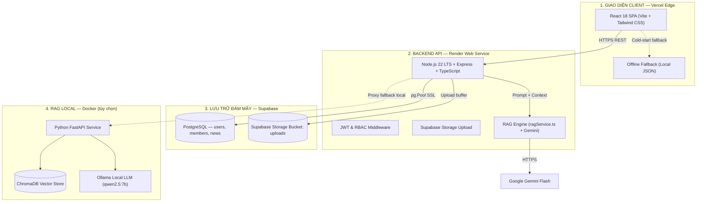
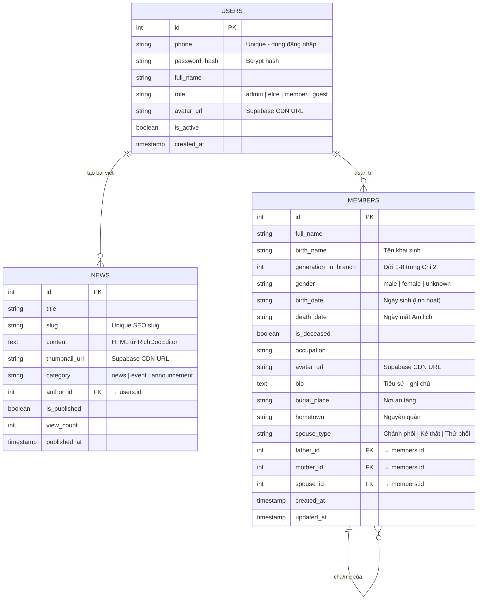

# Cổng Thông Tin & Gia Phả Số Hóa Dòng Họ Lê Văn - Phái 4 - Chi 2

> **Website chính thức:** [https://portal-holevan-phai4-chi2.vercel.app/](https://portal-holevan-phai4-chi2.vercel.app/)  
> **Backend API:** [https://portal-holevan-phai4-chi2.onrender.com](https://portal-holevan-phai4-chi2.onrender.com)

---

## 📖 Mục Lục

1. [Giới thiệu Dự án](#-giới-thiệu-dự-án)
2. [Kiến trúc Hệ thống](#-kiến-trúc-hệ-thống)
3. [Các Tính Năng Chính](#-các-tính-năng-chính)
4. [Cơ Sở Dữ Liệu](#-cơ-sở-dữ-liệu-postgresql)
5. [Cấu Trúc Thư Mục](#-cấu-trúc-thư-mục)
6. [Biến Môi Trường](#-biến-môi-trường)
7. [Triển Khai Production](#-triển-khai-production)
8. [Chạy Local với Docker](#-chạy-local-với-docker)
9. [Bản Quyền & Bảo Mật](#-bản-quyền--bảo-mật)

---

## 📖 Giới thiệu Dự án

Dự án **Portal Họ Lê Văn - Phái 4 - Chi 2** là nền tảng số hóa di sản dòng họ toàn diện, kết hợp công nghệ web hiện đại với trí tuệ nhân tạo thế hệ mới (**RAG - Retrieval Augmented Generation**).

Hệ thống quản lý dữ liệu **hơn 321 thành viên trải qua 8 thế hệ** (Đời 9 đến Đời 16 của Phái 4 Họ Lê Văn tại Thôn An Lợi, Xã Triệu Bình, Huyện Triệu Phong, Tỉnh Quảng Trị), với 4 phân hệ chính:

- 🔴 **Gia phả số**: Cây phả hệ trực quan, phân tầng theo đời, quản lý toàn bộ quan hệ huyết thống và hôn phối.
- 🟡 **Lịch giỗ kỵ**: Sổ kỵ nhật tiền nhân 12 tháng Âm lịch, tự động tính toán và đồng bộ khi cập nhật gia phả.
- 🟢 **Tư liệu - Sự kiện**: Tin tức, hoạt động, thông báo, tài liệu lịch sử họ tộc kèm phân quyền tác giả.
- 🔵 **Trợ lý AI dòng họ**: Tra cứu gia phả thông minh qua hội thoại tự nhiên với kho tri thức chuyên sâu.

---

## 🏛️ Kiến trúc Hệ thống

Mô hình kiến trúc phân tán (**Decoupled Architecture**), vận hành **24/7 miễn phí** trên Cloud:



---

## ✨ Các Tính Năng Chính

### 1. Cây Gia Phả Tương Tác (`FamilyTreePage.tsx`)
- **Thuật toán phân tầng tự động**: Tọa độ Y = `(generation - 1) × ΔY`; tọa độ X chống chồng lấn tự động theo bề rộng nhánh con cái.
- **Đa hôn phối**: Hiển thị Chánh phối, Kế thất, Thứ phối cạnh nhau; đường kết nối chuẩn xác theo từng cặp cha/mẹ → con.
- **Search & Auto-Focus**: Nhập tên → pan và zoom tự động định vị đúng vị trí tiền nhân trên cây.
- **Offline Fallback**: Khi Backend cold-start hoặc gặp sự cố mạng, tự động nạp `members.json` cục bộ.
- **Admin Panel**: Thêm/sửa/xóa thành viên, upload ảnh chân dung với công cụ cắt ảnh tỉ lệ 1:1 (`react-easy-crop`).

### 2. Lịch Giỗ Kỵ 12 Tháng Âm Lịch (`MemorialCalendarPage.tsx`)
- Danh sách hơn 109 vị tiền nhân đã quy tiên, phân nhóm theo 12 tháng Âm lịch.
- **Quy ước phong tục họ tộc**: Ngày cúng giỗ = Ngày mất − 1 (ví dụ: ngày mất 10/01 → ngày giỗ 09/01 Âm lịch).
- **Tự động đồng bộ**: Khi Quản trị viên cập nhật `death_date` hoặc `is_deceased` trong Gia phả → Lịch giỗ kỵ tự động phản ánh tức thì.
- Tìm kiếm đa năng: họ tên, đời thứ, tên thân phụ/thân mẫu, nơi an táng.

### 3. Tư Liệu - Sự Kiện Dòng Họ (`NewsPage.tsx`, `NewsDetailPage.tsx`)
- **Trình soạn thảo chuyên nghiệp**: `RichDocEditor` hỗ trợ định dạng văn bản phong phú, dán ảnh trực tiếp từ clipboard (`Ctrl+V`).
- **Upload & Cắt ảnh bìa**: Công cụ `react-easy-crop` linh hoạt nhiều tỉ lệ: 16:9 (Chuẩn bài viết), 4:3, 1:1 (Vuông) hoặc Tự do.
- **Phân quyền tác giả minh bạch**:
  - Ghi nhận và hiển thị tác giả: *"Bài viết được đăng bởi [Tên tác giả]"*.
  - 👑 **Quản trị viên**: Đăng bài mới, chỉnh sửa và xóa bài viết.
  - ⭐ **Thành viên ưu tú**: Được cấp quyền viết và đăng tải bài viết mới (không có quyền xóa hoặc sửa bài của tác giả khác).
  - 👤 **Thành viên tiêu chuẩn**: Xem bài viết, có lời nhắc nâng cấp tài khoản để mở khóa quyền đăng bài.
- **Lưu trữ & Phục vụ ảnh**: Phục vụ qua CDN Supabase Storage trên Cloud và Nginx tĩnh trên môi trường Docker.

### 4. Hệ Thống Tài Khoản, Phân Quyền & Bài Test Nâng Hạng (`UserProfileModal.tsx`, `Navbar.tsx`)
- **Phân cấp vai trò rõ ràng (3 cấp bậc)**:
  - 👑 **Trùm cuối (`admin`)**: Toàn quyền hệ thống, quản lý cây gia phả, lịch kỵ nhật và bài viết.
  - ⭐ **Thành viên ưu tú (`elite`)**: Quyền đăng bài viết mới trong mục Tư liệu - Sự kiện.
  - 👤 **Thành viên tiêu chuẩn (`member`)**: Quyền tra cứu cơ bản, tham gia làm bài test nâng cấp vai trò.
- **Hồ sơ cá nhân & Bài trắc nghiệm dòng họ**:
  - Tích hợp cửa sổ User Profile trực quan khi nhấp vào tên tài khoản hoặc thẻ thông báo.
  - Bộ 10 câu hỏi trắc nghiệm A/B tìm hiểu nguồn cội, tiền nhân và truyền thống dòng họ Lê Văn Phái 4 - Chi 2.
  - Làm đúng từ **5/10 câu trở lên**: Chúc mừng và tự động thăng hạng lên **Thành viên ưu tú**.
  - Kết quả rõ ràng, thân thiện và hỗ trợ làm lại không giới hạn mà không lộ đáp án.
- **Thẻ thông báo vai trò thông minh**:
  - Ghim sát mép phải màn hình ngay dưới Navbar (`fixed right-2 sm:right-3`), hiển thị trạng thái tài khoản hiện tại.
  - Tự động ẩn khi mở menu trên thiết bị di động để tránh chồng đè giao diện.

### 5. Trợ Lý AI Gia Phả (RAG Engine & Floating Chatbot)
- **Thiết kế biểu tượng Chatbot sang trọng**:
  - Nút bấm AI nổi bật với hình ảnh đại diện Robot 3D tông màu Đỏ - Vàng kim truyền thống (`/ai-robot.jpg`).
  - Đèn báo trạng thái trực tuyến (online) xanh lá tròn trịa, nổi hoàn toàn trên nút bấm không bị cắt xén viền.
  - Lời chào nhập môn trang trọng: *"Xin chào! Tôi là trợ lý AI của trang Portal Chi 2 - Phái 4 - Họ Lê Văn..."*.
- **In-Backend RAG Engine** (`ragService.ts`):
  - Chạy trực tiếp trong Node.js Backend, truy vấn kết hợp Google Gemini Flash.
  - Bộ tri thức chuẩn hóa 3 tài liệu Markdown: lịch sử dòng họ, kỵ nhật tiền nhân và hồ sơ thành viên.
  - Thuật toán mở rộng ngữ cảnh phả hệ đa quan hệ (thân phụ, thân mẫu, phối ngẫu, con cái).
  - Cơ chế **Exponential Backoff** tự động thử lại khi gặp giới hạn tốc độ API (Rate Limit 429).
- **Python RAG Service** (Tùy chọn Local Docker): FastAPI + ChromaDB + Ollama (`qwen2.5:7b`).

### 6. Giao Diện Người Dùng Đồng Bộ & Thẩm Mỹ (UI/UX)
- **Thanh điều hướng (Navbar)**: Đồng bộ icon và tên gọi:
  - 🏠 **Trang chủ**
  - 📖 **Gia phả số**
  - 📅 **Lịch giỗ kỵ**
  - 📰 **Tư liệu - Sự kiện**
- **Banner chính**: Nút bấm đôi trang nhã **"Xem Gia Phả"** và **"Xem Lịch Giỗ"**.
- **Chỉ số dòng họ**: Tích hợp icon màu vàng kim sắc nét:
  - 🏛️ **8+ Đời** (Biểu tượng Nhà thờ họ - `Landmark`)
  - 👥 **300+ Thành viên** (Biểu tượng Hội đồng thân tộc - `Users`)
  - 🕒 **250+ Năm lịch sử** (Biểu tượng Thời gian - `Clock`)
- **4 Thẻ tính năng nổi bật**: Phối màu pastel truyền thống với icon chuyên biệt (`BookOpen`, `Calendar`, `Newspaper`, `Bot`).
- **Chân trang (Footer)**:
  - Logo dòng họ được đặt trang trọng bên cạnh tiêu đề **CHI 2 - PHÁI 4 - HỌ LÊ VĂN**.
  - Icon điện thoại bàn (📞 **Liên hệ**) và icon kẹp tài liệu (📎 **Liên kết**).
  - Dòng bản quyền căn giữa trang trọng, tinh tế.

---

## 🗄️ Cơ Sở Dữ Liệu (PostgreSQL)

Hệ thống sử dụng cơ sở dữ liệu quan hệ tối ưu với 3 bảng chính:



---

## 📁 Cấu Trúc Thư Mục

```
Portal-HoLeVan-Phai4-Chi2/
├── .env.example                    # Mẫu khai báo biến môi trường
├── .gitignore
├── docker-compose.yml              # Khởi chạy toàn bộ hệ thống cục bộ
├── README.md                       # Tài liệu tổng thể dự án
│
├── backend/                        # Backend API (Node.js 22 / Express / TypeScript)
│   ├── src/
│   │   ├── config/
│   │   │   ├── db.ts               # PostgreSQL Pool (SSL) + initDb()
│   │   │   ├── initSql.ts          # Schema 3 bảng: users, members, news
│   │   │   ├── init_postgres.sql   # Schema SQL thuần
│   │   │   ├── seed_members.ts     # Nạp 321 thành viên nếu bảng trống
│   │   │   └── seed_news.ts        # Nạp bài viết mẫu nếu bảng trống
│   │   ├── controllers/
│   │   │   ├── authController.ts   # Đăng nhập, JWT, upgrade role, profile
│   │   │   ├── membersController.ts# CRUD thành viên gia phả
│   │   │   ├── memorialsController.ts # Tính toán & trả kỵ nhật động
│   │   │   ├── newsController.ts   # CRUD bài viết / tư liệu
│   │   │   └── chatController.ts   # Điều phối RAG + AI Chat
│   │   ├── middleware/
│   │   │   ├── auth.ts             # verifyToken, requireAdmin, requireEliteOrAdmin
│   │   │   └── upload.ts           # Multer + Supabase Storage CDN
│   │   ├── routes/
│   │   │   ├── auth.ts
│   │   │   ├── members.ts
│   │   │   ├── memorials.ts
│   │   │   ├── news.ts
│   │   │   └── chat.ts
│   │   ├── services/
│   │   │   └── ragService.ts       # In-Backend RAG Engine + Gemini Flash
│   │   ├── data/
│   │   │   ├── members.json        # Dữ liệu 321 thành viên
│   │   │   ├── news.json           # Dữ liệu bài viết mẫu
│   │   │   └── knowledge/          # 3 file Markdown tri thức cho RAG
│   │   │       ├── gia_pha_chi_tiet_ho_le_van.md
│   │   │       ├── lich_gio_ky_va_an_tang.md
│   │   │       └── tong_quan_va_thong_ke_dong_ho.md
│   │   └── server.ts               # Khởi chạy Express HTTP Server
│   ├── scripts/
│   │   └── copy_knowledge.js       # Sao chép Markdown vào dist/ khi build
│   ├── Dockerfile
│   ├── package.json
│   └── tsconfig.json
│
├── frontend/                       # Giao diện (React 18 / Vite / TypeScript / Tailwind)
│   ├── public/
│   │   ├── ai-robot.jpg            # Ảnh đại diện Trợ lý AI tông đỏ - vàng
│   │   ├── favicon.ico             # Logo dòng họ
│   │   └── background.jpg          # Ảnh toàn cảnh Nhà thờ họ
│   ├── src/
│   │   ├── components/
│   │   │   ├── FamilyTree/         # @xyflow/react: MemberNode, TreeControls, layoutEngine
│   │   │   ├── Chatbot/            # ChatbotPanel.tsx (Floating button & AI chatbox)
│   │   │   ├── Layout/             # Navbar.tsx, Footer.tsx
│   │   │   ├── Auth/               # LoginModal.tsx, RegisterModal.tsx, UserProfileModal.tsx
│   │   │   ├── News/               # NewsCard.tsx, RichDocEditor.tsx
│   │   │   └── common/             # LoadingSpinner.tsx, ...
│   │   ├── pages/
│   │   │   ├── HomePage.tsx            # Trang chủ & các khối chức năng
│   │   │   ├── FamilyTreePage.tsx      # Cây gia phả tương tác
│   │   │   ├── MemorialCalendarPage.tsx# Lịch giỗ kỵ 12 tháng Âm lịch
│   │   │   ├── NewsPage.tsx            # Danh sách tư liệu - sự kiện
│   │   │   └── NewsDetailPage.tsx      # Chi tiết bài viết
│   │   ├── services/
│   │   │   ├── api.ts              # Axios base instance
│   │   │   ├── authService.ts      # Xác thực & nâng cấp vai trò
│   │   │   ├── memberService.ts    # API thành viên
│   │   │   └── newsService.ts      # API bài viết
│   │   ├── store/
│   │   │   └── authStore.ts        # Zustand quản lý trạng thái phiên
│   │   ├── data/
│   │   │   ├── members.json        # Offline fallback phả hệ
│   │   │   ├── memorials.json      # Offline fallback kỵ nhật
│   │   │   └── news.json           # Offline fallback bài viết
│   │   ├── types/index.ts          # TypeScript interfaces
│   │   └── hooks/useChat.ts        # Hook quản lý hội thoại AI
│   ├── nginx.conf                  # Cấu hình máy chủ web Docker frontend
│   ├── Dockerfile
│   ├── package.json
│   └── vite.config.ts
│
└── rag-service/                    # Python RAG Service (Tùy chọn — Dùng cho Local Docker)
    ├── src/
    │   ├── main.py                 # FastAPI Server
    │   ├── ingest.py               # Vector hóa tài liệu → ChromaDB
    │   ├── rag_pipeline.py         # LangChain + ChromaDB + Ollama/Gemini
    │   ├── config.py               # Cấu hình Pydantic
    │   └── models.py               # Schema Pydantic
    ├── scripts/
    │   └── generate_rag_documents.py # Trích xuất JSON gia phả thành Markdown RAG
    ├── data/raw_documents/         # Dữ liệu Markdown phục vụ index
    ├── Dockerfile
    └── requirements.txt
```

---

## 🔐 Biến Môi Trường

### Backend (`backend` — cấu hình trên Render hoặc `.env`)

| Tên Biến | Bắt Buộc | Ý Nghĩa |
|---|:---:|---|
| `DATABASE_URL` | ✅ | Chuỗi kết nối PostgreSQL Supabase (Pooler Transaction) |
| `JWT_SECRET` | ✅ | Khóa bí mật ký JWT (tối thiểu 32 ký tự) |
| `SUPABASE_URL` | ✅ | `https://[project-ref].supabase.co` |
| `SUPABASE_SERVICE_ROLE_KEY` | ✅ | Khóa `service_role` ghi file vào Storage |
| `SUPABASE_STORAGE_BUCKET` | ✅ | Tên bucket (mặc định: `uploads`) |
| `GEMINI_API_KEY` | ✅ | Lấy từ [Google AI Studio](https://aistudio.google.com/) |
| `PORT` | Không | Cổng server (mặc định: `5000`) |
| `NODE_ENV` | Không | `production` hoặc `development` |

### Frontend (`frontend` — cấu hình trên Vercel hoặc `.env`)

| Tên Biến | Bắt Buộc | Ý Nghĩa |
|---|:---:|---|
| `VITE_API_URL` | ✅ | URL Backend API, ví dụ: `https://portal-holevan-phai4-chi2.onrender.com/api` |

---

## 🚀 Triển Khai Production

### Bước 1: Chuẩn bị Supabase Cloud
1. Đăng ký tại [supabase.com](https://supabase.com/) → Tạo Project mới.
2. **Database** → **Connection Pooling** → Sao chép URI kết nối dạng `Transaction`.
3. **Storage** → **New Bucket** → Đặt tên `uploads` → Bật **Public bucket** → Lưu.
4. **Project Settings** → **API** → Sao chép `Project URL` và `service_role` key.

### Bước 2: Triển khai Backend trên Render
1. [Render Dashboard](https://dashboard.render.com/) → **New** → **Web Service** → Kết nối GitHub repo.
2. Cấu hình dịch vụ:
   - **Root Directory:** `backend`
   - **Build Command:** `npm install && npm run build`
   - **Start Command:** `npm start`
   - **Plan:** Free
3. Thêm các biến môi trường Backend vào mục **Environment**.
4. Deploy và sao chép URL dịch vụ được cấp.

### Bước 3: Triển khai Frontend trên Vercel
1. [Vercel Dashboard](https://vercel.com/) → **Add New Project** → Import GitHub repo.
2. Cấu hình triển khai:
   - **Framework:** `Vite`
   - **Root Directory:** `frontend`
3. Thêm biến môi trường: `VITE_API_URL` = `https://<ten-backend-render>.onrender.com/api`
4. Deploy.

---

## 💻 Chạy Local với Docker

> Yêu cầu: Đã cài đặt **Docker Desktop**.

```bash
# 1. Clone repository về máy
git clone https://github.com/LGKAI/Portal-HoLeVan-Phai4-Chi2.git
cd Portal-HoLeVan-Phai4-Chi2

# 2. Khởi chạy toàn bộ hệ thống (PostgreSQL + Backend + Frontend + RAG Service)
docker compose up -d --build

# 3. Theo dõi log hoạt động
docker compose logs -f
```

**Danh mục dịch vụ và cổng truy cập:**
| Dịch vụ | URL | Mô tả |
|---|---|---|
| Giao diện Frontend | http://localhost:3000 | Giao diện React SPA qua Nginx |
| Backend API | http://localhost:5000 | Node.js Express REST API |
| Python RAG Service | http://localhost:8000 | FastAPI Vector Search / AI Chat |
| PostgreSQL Database | localhost:5432 | Cơ sở dữ liệu quan hệ cục bộ |

**Tài khoản Quản trị viên (Admin) mặc định:**
- Số điện thoại: `0901234567`
- Mật khẩu: `Admin@123456`
- Vai trò: 👑 **Trùm cuối**

---

## 🛡️ Bản Quyền & Bảo Mật

**Quyền Sở Hữu Dữ Liệu:**
> Toàn bộ dữ liệu phả hệ, thông tin thân tộc, hình ảnh và vị trí mộ phần thuộc quyền sở hữu thiêng liêng của Hội đồng Gia tộc **Họ Lê Văn - Phái 4 - Chi 2**, Thôn An Lợi, Xã Triệu Bình, Huyện Triệu Phong, Tỉnh Quảng Trị.

**Nguyên Tắc Bảo Mật & Đạo Đức:**
- Tuyệt đối không lưu trữ thông tin nhạy cảm, mật khẩu hoặc khóa bí mật trong mã nguồn công khai.
- Mật khẩu người dùng được băm mã hóa một chiều qua thuật toán **Bcrypt** (salt rounds = 10).
- Hệ thống phân quyền chặt chẽ thông qua **JWT + RBAC** (`admin` / `elite` / `member`).
- Trợ lý AI tuân thủ nghiêm ngặt chỉ thị tôn kính danh xưng tiền nhân và chống ảo giác thông tin.