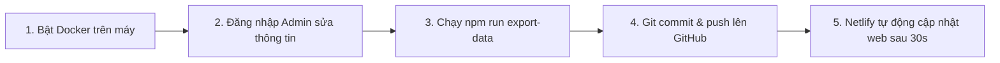

# Portal Chi 2 - Phái 4 - Họ Lê Văn

Hệ thống **Cổng thông tin & Gia phả số hóa** dòng họ **Lê Văn (Chi 2 - Phái 4)** — Thôn An Lợi, Xã Triệu Bình, Tỉnh Quảng Trị. 

Dự án kết hợp công nghệ web hiện đại với trí tuệ nhân tạo (**RAG - Retrieval Augmented Generation**) nhằm bảo tồn và phát huy truyền thống tổ tiên, số hóa cây gia phả tương tác đa thế hệ, cập nhật tư liệu và sự kiện dòng họ, đồng thời hỗ trợ con cháu tra cứu cội nguồn nhanh chóng qua **Trợ lý AI dòng họ**.

---

## 1. Kiến trúc & Công nghệ sử dụng

Hệ thống được thiết kế theo kiến trúc Microservices / Client-Server tách biệt, bao gồm 4 thành phần chính:

### 1.1. Frontend (Giao diện Web)
- **Framework:** React 18, Vite 5
- **Ngôn ngữ:** TypeScript
- **Styling:** Tailwind CSS, Lucide React (bộ icon tối giản hiện đại)
- **Quản lý State:** Zustand (quản lý trạng thái phiên đăng nhập, thông tin người dùng)
- **Cây gia phả tương tác:** `@xyflow/react` (React Flow v12)
  - Thuật toán căn chỉnh layout tự động phân tầng con cái theo từng đời vợ (Chánh phối, Thứ phối, Thứ thứ phối...).
  - Đường nối huyết thống trực tiếp từ trung điểm của người cha và người mẹ sinh thành.
  - Sắp xếp thứ tự trực quan chuẩn xác từ trái sang phải khớp với vị trí nhánh cây trên biểu đồ phả hệ khi lọc xem từng đời.
  - Bảng thống kê động thời gian thực ở góc trên bên trái: **Tổng số thành viên** (Xanh dương), **Số thành viên đã mất** (Đỏ), **Số thành viên còn sống** (Xanh lá).
- **Cơ chế Dữ liệu Tĩnh (Static Fallback):** Tự động phát hiện khi chạy trên các nền tảng Static Cloud (như Netlify) để nạp dữ liệu offline từ file JSON và thư mục ảnh tĩnh, giúp website hoạt động mượt mà 100% không cần máy chủ backend.
- **Cắt xén ảnh chân dung:** `react-easy-crop` (cắt ảnh bo tròn chuẩn avatar trước khi tải lên)
- **Định tuyến SPA:** React Router DOM v6
- **Cấu hình Cổng:** Cố định duy nhất tại cổng `:3000` (`strictPort: true`)

### 1.2. Backend (API Server)
- **Framework:** Node.js, Express.js
- **Ngôn ngữ:** TypeScript
- **Database Driver:** `mssql` (kết nối Microsoft SQL Server)
- **Xác thực:** JSON Web Token (JWT) + mã hóa mật khẩu `bcryptjs`
- **Quản lý Upload:** `multer` (xử lý upload ảnh chân dung thành viên và ảnh bài viết, cơ chế tự động dọn dẹp file ảnh cũ bị thay thế khi cập nhật hoặc xoá để tối ưu dung lượng)
- **Bảo mật & Middleware:** Helmet, CORS, Express Async Errors
- **Cổng dịch vụ:** Chạy tại cổng `:5000`

### 1.3. RAG Service (Trợ lý AI Tra cứu Dòng họ)
- **Framework:** Python 3.10+, FastAPI, Uvicorn
- **Framework AI:** LangChain (LangChain Core, LangChain Community, LangChain Chroma)
- **Vector Database:** ChromaDB (lưu trữ vector embeddings cục bộ)
- **Mô hình AI cục bộ (Local LLM via Ollama):**
  - **LLM:** `qwen2.5:7b` (hỗ trợ tiếng Việt tự nhiên, chuẩn xác)
  - **Embedding Model:** `nomic-embed-text`
- **Cổng dịch vụ:** Chạy tại cổng `:8000`

### 1.4. Cơ sở dữ liệu & Hạ tầng
- **Cơ sở dữ liệu:** Microsoft SQL Server 2022 Developer Edition (Collation `Vietnamese_CI_AS` chuẩn tiếng Việt)
- **Containerization:** Docker & Docker Compose
- **Web Server Production:** Nginx Alpine (Reverse Proxy & Serve static files React)
- **Hosting Static:** Hỗ trợ deploy trọn gói lên Netlify (0 VNĐ)

---

## 2. Bảng phân bổ Cổng kết nối (Ports)

| Dịch vụ | Cổng Host | Cổng Container | Mô tả |
| :--- | :---: | :---: | :--- |
| **Frontend Web** | **`:3000`** | `80` (Docker) / `3000` (Dev) | Giao diện web người dùng & quản trị |
| **Backend API** | **`:5000`** | `5000` | Hệ thống RESTful API |
| **RAG AI Service** | **`:8000`** | `8000` | Dịch vụ AI & Vector Database ChromaDB |
| **MSSQL Database** | **`:1433`** | `1433` | Cơ sở dữ liệu quan hệ SQL Server |
| **Ollama (Host)** | **`:11434`** | Máy host | Cung cấp inference LLM & Embeddings |

> [!NOTE]
> **Về cấu hình cổng `:3000`:** 
> Cấu hình Vite đã được thiết lập `strictPort: true`. Frontend sẽ **luôn luôn chạy cố định ở cổng `:3000`**, ngăn chặn việc tự ý nhảy sang `:3001` khi xảy ra xung đột.

---

## 3. Cấu trúc thư mục dự án

```
Portal-HoLeVan-Phai4-Chi2/
├── .env                              # File biến môi trường thực tế
├── .env.example                      # File mẫu biến môi trường
├── .gitignore                        # Cấu hình bỏ qua file trong Git
├── docker-compose.yml                # Cấu hình Docker Compose toàn bộ hệ thống
├── netlify.toml                      # Cấu hình build & redirect SPA cho Netlify
├── README.md                         # Tài liệu hướng dẫn dự án
│
├── backend/                          # Mã nguồn Backend (Node.js/Express + TypeScript)
│   ├── src/
│   │   ├── config/                   # Kết nối CSDL (db.ts) & script tạo bảng (init.sql)
│   │   ├── controllers/              # Bộ điều khiển (auth, members, news)
│   │   ├── middleware/               # Xác thực JWT (auth.ts), xử lý upload ảnh (upload.ts)
│   │   ├── routes/                   # Khai báo các endpoints API (/api/auth, /members, /news)
│   │   ├── types/                    # Định nghĩa TypeScript interfaces
│   │   └── server.ts                 # Điểm khởi động Express server
│   ├── .env.example                  # Mẫu biến môi trường Backend
│   ├── Dockerfile                    # Dockerfile đóng gói container Backend
│   ├── package.json
│   └── tsconfig.json
│
├── frontend/                         # Mã nguồn Frontend (React 18 + Vite + TypeScript)
│   ├── public/                       # Tài nguyên tĩnh:
│   │   ├── _redirects                # File điều hướng SPA cho Netlify
│   │   ├── background.jpg            # Ảnh nền Banner Nhà thờ mộ trung tâm
│   │   ├── favicon.ico               # Huy hiệu dòng họ (Logo/Favicon)
│   │   └── uploads/                  # Thư mục ảnh đại diện (avatars) và ảnh sự kiện (thumbnails) đang sử dụng
│   ├── scripts/
│   │   └── export-data.js            # Kịch bản thông minh tự động xuất dữ liệu sạch sang file tĩnh
│   ├── src/
│   │   ├── components/
│   │   │   ├── Auth/                 # Modal đăng nhập (LoginModal), đăng ký (RegisterModal)
│   │   │   ├── Chatbot/              # Hộp chat trợ lý AI nổi góc dưới phải (ChatbotPanel)
│   │   │   ├── common/               # Component dùng chung (LoadingSpinner, ScrollToTop...)
│   │   │   ├── FamilyTree/           # Thành phần Cây gia phả (TreeCanvas, MemberNode...)
│   │   │   ├── Layout/               # Thanh điều hướng (Navbar) & Chân trang (Footer)
│   │   │   └── News/                 # Thẻ bài viết tư liệu & sự kiện (NewsCard)
│   │   ├── data/                     # Dữ liệu tĩnh dự phòng phục vụ deploy Netlify:
│   │   │   ├── members.json          # 306 thành viên và toàn bộ liên kết phả hệ
│   │   │   └── news.json             # Danh sách bài viết tư liệu & sự kiện
│   │   ├── hooks/                    # Custom hooks (useChat, useFamilyTree)
│   │   ├── pages/                    # Các trang màn hình (Home, Tree, News, NewsDetail)
│   │   ├── services/                 # Gọi API backend kèm cơ chế tự động Fallback dữ liệu tĩnh
│   │   ├── store/                    # Zustand store (authStore)
│   │   ├── types/                    # Định nghĩa kiểu dữ liệu (Member, User, NewsItem...)
│   │   ├── utils/                    # Tiện ích cắt xén ảnh canvas (cropImage.ts)
│   │   ├── App.tsx                   # Định tuyến Router
│   │   ├── index.css                 # CSS toàn cục & cấu hình Tailwind
│   │   └── main.tsx                  # Điểm khởi tạo ứng dụng React
│   ├── nginx.conf                    # Cấu hình Nginx reverse proxy cho Docker production
│   ├── Dockerfile                    # Multi-stage build (Node builder -> Nginx Alpine)
│   ├── package.json
│   ├── tailwind.config.js
│   └── vite.config.ts                # Cấu hình Vite (port: 3000, strictPort: true, proxy API)
│
└── rag-service/                      # Dịch vụ Trợ lý AI (Python FastAPI + LangChain + ChromaDB)
    ├── src/
    │   ├── config.py                 # Cấu hình tham số RAG & Ollama
    │   ├── ingest.py                 # Kịch bản đồng bộ dữ liệu gia phả vào Vector Database
    │   ├── main.py                   # FastAPI app (API endpoints: /chat, /ingest, /health)
    │   ├── models.py                 # Pydantic schemas cho request/response
    │   └── rag_pipeline.py           # Luồng truy xuất thông tin & sinh câu trả lời RAG
    ├── data/
    │   └── raw_documents/            # Thư mục lưu trữ văn bản thô phục vụ nạp kiến thức bổ sung
    ├── .env.example                  # Mẫu biến môi trường cho RAG Service
    ├── Dockerfile
    └── requirements.txt              # Danh sách thư viện Python
```

---

## 4. Các tính năng cốt lõi

### 4.1. Cây gia phả số hóa tương tác (`/tree`)
- **Hiển thị trực quan:** Xem toàn bộ cây gia phả nhiều thế hệ (từ Đời thứ 9 đến Đời thứ 16 theo thứ bậc Phái 4).
- **Thứ tự chuẩn xác:** Danh sách thành viên khi lọc theo từng đời hiển thị đúng thứ tự từ trái sang phải trên sơ đồ cây gia phả (đảm bảo tính nhất quán giữa biểu đồ phả hệ và danh sách tra cứu).
- **Quan hệ hôn phối & huyết thống:**
  - Tự động nhận diện thứ bậc vợ chồng: *Chánh phối*, *Thứ phối*, *Thứ thứ phối*...
  - Cho phép chỉ định chính xác **Người mẹ sinh thành** trong gia đình đa thê để đường nối huyết thống xuất phát chuẩn xác từ trung điểm giữa người cha và người mẹ tương ứng.
- **Thống kê thời gian thực (Góc trên bên trái, dưới ô tìm kiếm):**
  - **- Tổng số thành viên:** Hiển thị màu xanh dương (**Blue**).
  - **- Số thành viên đã mất:** Hiển thị màu đỏ (**Red**).
  - **- Số thành viên còn sống:** Hiển thị màu xanh lá (**Green**).
  - Sử dụng thuật toán đếm động phản hồi ngay lập tức khi có thay đổi dữ liệu.
- **Tìm kiếm & Bộ lọc:** Tìm kiếm tức thì theo họ tên thành viên; lọc hiển thị theo từng Đời cụ thể.
- **Quản trị viên:** Thêm con cái, thêm hôn phối, chỉnh sửa thông tin chi tiết, tải ảnh chân dung bo tròn và xóa thành viên với hộp thoại xác nhận an toàn (tự động xóa ảnh cũ khỏi ổ đĩa).

### 4.2. Tư liệu - Sự kiện dòng họ (`/news`)
- Cập nhật các thông báo, hoạt động truyền thống (Lễ tảo mộ, chạp mả, giỗ tổ, khuyến học...).
- Đăng tải bài viết kèm hình ảnh minh họa, tự động tạo slug thân thiện, đếm số lượt xem và định dạng thời gian tiếng Việt.
- Xem chi tiết bài viết với ảnh bìa gốc nguyên vẹn kích thước chuẩn (không bị cắt xén ngang).
- Quản trị viên có toàn quyền đăng mới, chỉnh sửa nội dung và xóa bài viết (tự động xóa ảnh bìa cũ khi thay thế).

### 4.3. Trợ lý AI Dòng họ (AI Chatbot)
- Trợ lý AI thông minh sẵn sàng trò chuyện và giải đáp 24/7.
- Sử dụng mô hình ngôn ngữ lớn cục bộ qua Ollama (`qwen2.5:7b`), bảo mật tuyệt đối dữ liệu nội bộ dòng họ.
- Tích hợp kỹ thuật **RAG (Retrieval Augmented Generation)**: tự động truy xuất thông tin từ cơ sở dữ liệu phả hệ để trả lời chính xác các câu hỏi về tổ tiên, quan hệ gia đình, vai vế họ hàng.

---

## 5. Yêu cầu môi trường (Prerequisites)

Trước khi tiến hành cài đặt, máy tính cần có:
1. **Docker Desktop:** [Tải Docker](https://www.docker.com/) (yêu cầu kích hoạt WSL2 trên Windows).
2. **Node.js:** Phiên bản 18 LTS hoặc 20 LTS (nếu muốn chạy phát triển cục bộ).
3. **Ollama:** [Tải Ollama](https://ollama.com/) (dành cho tính năng Trợ lý AI). Sau khi cài đặt, tải 2 mô hình sau:
   ```bash
   ollama pull qwen2.5:7b
   ollama pull nomic-embed-text
   ```

---

## 6. Hướng dẫn khởi chạy trên máy cục bộ (Local)

### Bước 1: Chuẩn bị file môi trường
Tạo file `.env` tại thư mục gốc từ file mẫu:
```bash
# Trên Linux/macOS
cp .env.example .env

# Trên Windows PowerShell
Copy-Item .env.example .env
```

---

### Cách 1: Khởi chạy trọn gói bằng Docker Compose (Khuyên dùng)
Phương thức này sẽ tự động build và chạy toàn bộ 4 containers: Database MSSQL, Backend API, Frontend Web (Nginx), và RAG AI Service.

1. **Khởi động toàn bộ hệ thống:**
   ```bash
   docker-compose up -d --build
   ```

2. **Khởi tạo bảng cơ sở dữ liệu (chỉ cần thực hiện trong lần đầu tiên):**
   ```bash
   docker exec -i portal_mssql /opt/mssql-tools18/bin/sqlcmd -S localhost -U sa -P "Portal@Hle2024!" -d portal_hlevan -C < backend/src/config/init.sql
   ```

3. **Truy cập các dịch vụ:**
   - **Giao diện Web:** [http://localhost:3000](http://localhost:3000)
   - **Backend API:** [http://localhost:5000](http://localhost:5000)
   - **Tài liệu Swagger RAG AI:** [http://localhost:8000/docs](http://localhost:8000/docs)

4. **Dừng toàn bộ hệ thống:**
   ```bash
   docker-compose down
   ```

---

### Cách 2: Phát triển cục bộ (Local Development với Hot-Reload)
Khi cần phát triển và chỉnh sửa mã nguồn với tính năng Hot-Module Replacement (HMR):

1. **Khởi chạy Database & RAG Service bằng Docker:**
   ```bash
   docker-compose up -d mssql rag-service
   ```

2. **Khởi chạy Backend:**
   ```bash
   cd backend
   npm install
   npm run dev
   ```
   Backend sẽ lắng nghe tại [http://localhost:5000](http://localhost:5000).

3. **Khởi chạy Frontend:**
   ```bash
   cd frontend
   npm install
   npm run dev
   ```
   Frontend sẽ mở tại cổng cố định [http://localhost:3000](http://localhost:3000).

---

## 7. Hướng dẫn Deploy miễn phí lên Netlify (0 VNĐ - Kết nối GitHub)

Website đã được cấu hình cơ chế **Static Data Fallback thông minh**:
- Khi deploy lên **Netlify**, website hoạt động độc lập 100% không cần máy chủ backend/database.
- Toàn bộ dữ liệu 306 thành viên, cây gia phả, 154 ảnh đại diện & ảnh sự kiện, bài viết tư liệu sự kiện đều hoạt động mượt mà với tốc độ tức thì, có sẵn chứng chỉ HTTPS bảo mật và tên miền miễn phí trọn đời (ví dụ: `https://portal-holevan-phai4-chi2.netlify.app/`).

### 7.1. Các bước Deploy lần đầu qua GitHub (Tự động cập nhật)

#### Bước 1: Đẩy toàn bộ mã nguồn lên GitHub
Mở terminal tại thư mục gốc của dự án (`Portal-HoLeVan-Phai4-Chi2`):
```bash
git add -A
git commit -m "feat: config static data and netlify deploy"
git push origin main
```

#### Bước 2: Đăng nhập Netlify và chọn Repository
1. Truy cập [https://app.netlify.com/](https://app.netlify.com/) và đăng nhập bằng tài khoản **GitHub**.
2. Nhấn nút **Add new site** ➔ Chọn **Import an existing project**.
3. Chọn nhà cung cấp Git là **GitHub**.
4. Cấp quyền truy cập (Authorize) và chọn repository của bạn:  
   👉 `Portal-HoLeVan-Phai4-Chi2`.

#### Bước 3: Kiểm tra cấu hình Build Settings
Netlify sẽ tự động nhận diện file [netlify.toml](file:///d:/ChuyenNganhAI/Portal-HoLeVan-Phai4-Chi2/netlify.toml) có sẵn trong dự án:
- **Base directory:** `frontend`
- **Build command:** `npm run build`
- **Publish directory:** `frontend/dist` (hoặc `dist`)

#### Bước 4: Khởi chạy Deploy
- Nhấn nút **Deploy Portal-HoLeVan-Phai4-Chi2** (hoặc **Deploy site**).
- Chờ khoảng 1 - 2 phút để Netlify tải mã nguồn và build trang web. Khi thấy trạng thái chuyển sang **Published** màu xanh lá là website đã chính thức online!

#### Bước 5: Đổi tên miền Netlify cho đẹp và dễ nhớ
- Vào mục **Site configuration** (hoặc **Site settings**) ➔ Chọn **Change site name**.
- Nhập tên mong muốn (ví dụ: `holevan-phai4chi2`).
- Địa chỉ truy cập website chính thức của dòng họ sẽ là:  
   👉 **`https://portal-holevan-phai4-chi2.netlify.app/`**

---

### 7.2. Quy trình cập nhật dữ liệu gia phả & bài viết mới sau này

Sau này, khi có thành viên mới sinh, người mất, bổ sung thông tin hoặc đăng bài viết sự kiện mới:



1. **Bước 1: Chỉnh sửa dữ liệu trên máy cá nhân**
   - Bật Docker trên máy: `docker-compose up -d`
   - Mở trình duyệt vào `http://localhost:3000`, đăng nhập tài khoản Quản trị viên (`0901234567` / `Admin@123`).
   - Thêm/sửa thành viên, tải ảnh đại diện, hoặc đăng bài viết mới vào hệ thống.

2. **Bước 2: Xuất dữ liệu tĩnh và build kiểm tra**
   Mở terminal, chuyển vào thư mục `frontend` và chạy 2 lệnh sau:
   ```bash
   cd frontend
   npm run export-data
   npm run build
   ```
   > 💡 **Lệnh `npm run export-data` thực hiện tự động các công việc thông minh:**
   > - Trích xuất toàn bộ dữ liệu 306 thành viên từ SQL Server sang `src/data/members.json`.
   > - Trích xuất danh sách bài viết sang `src/data/news.json`.
   > - **Chỉ đồng bộ các file ảnh thực tế đang hiển thị trên web** về `public/uploads/`.
   > - **Tự động quét và xoá bỏ mọi ảnh thừa, ảnh rác, ảnh đã bị thay thế** (cả trên máy local và trong container Docker `portal_backend`), giúp repository luôn gọn nhẹ và tối ưu dung lượng.

3. **Bước 3: Đẩy dữ liệu mới lên GitHub**
   Quay lại thư mục gốc và đẩy commit lên GitHub:
   ```bash
   git add -A
   git commit -m "Cập nhật dữ liệu gia phả và tư liệu mới"
   git push origin main
   ```

4. **Bước 4: Hoàn tất**
   - Netlify sẽ tự động phát hiện commit mới trên GitHub, tự động build và xuất bản phiên bản mới nhất.
   - Sau khoảng 30 - 60 giây, website trực tuyến sẽ tự động cập nhật dữ liệu mới cho tất cả mọi người cùng xem!

---

## 8. Thông tin Quản trị & Cơ sở dữ liệu

### 8.1. Tài khoản Quản trị viên (Admin mặc định)
Sau khi chạy script khởi tạo `init.sql`, hệ thống tự động có sẵn tài khoản:
- **Số điện thoại:** `0901234567`
- **Mật khẩu:** `Admin@123`

*Quyền hạn quản trị viên: Quản lý cây gia phả (thêm, sửa, xóa thành viên, gắn quan hệ cha-mẹ-con, hôn phối, đổi ảnh đại diện), đăng tải, chỉnh sửa và quản lý bài viết Tư liệu - Sự kiện.*

### 8.2. Kết nối Cơ sở dữ liệu SQL Server
Cổng `1433` đã được ánh xạ ra máy host. Có thể kết nối qua Azure Data Studio, DBeaver hoặc SQL Server Management Studio (SSMS):
- **Host / Server:** `localhost,1433` (hoặc `127.0.0.1,1433`)
- **Authentication:** SQL Server Authentication
- **User:** `sa`
- **Password:** `Portal@Hle2024!`
- **Database:** `portal_hlevan`

---

## 9. Đồng bộ dữ liệu vào Trợ lý AI (RAG Ingestion)

Mỗi khi dữ liệu gia phả có sự thay đổi lớn hoặc sau khi nạp dữ liệu ban đầu, bạn có thể gọi API để AI nạp vector kiến thức mới nhất:

```bash
# Trên Linux/macOS
curl -X POST http://localhost:8000/ingest/members

# Trên Windows PowerShell
Invoke-RestMethod -Method Post -Uri http://localhost:8000/ingest/members
```

---

## 10. Xử lý sự cố thường gặp (Troubleshooting)

### 1. Xung đột cổng `:3000` (`Port 3000 is in use`)
- **Nguyên nhân:** Container `portal_frontend` của Docker đang chạy và chiếm giữ cổng 3000.
- **Xử lý:**
  ```bash
  docker stop portal_frontend
  # Sau đó chạy lệnh dev cục bộ:
  cd frontend && npm run dev
  ```

### 2. Xem log trực tiếp của từng container
- Log Backend: `docker logs -f portal_backend`
- Log Frontend (Nginx): `docker logs -f portal_frontend`
- Log RAG AI Service: `docker logs -f portal_rag`
- Log SQL Server: `docker logs -f portal_mssql`

### 3. RAG AI Service không kết nối được Ollama
- Kiểm tra xem tiến trình Ollama đã khởi động chưa: `ollama list`.
- Đảm bảo biến `OLLAMA_BASE_URL` trong file `.env` trỏ đến `http://host.docker.internal:11434` (để container Docker có thể gọi dịch vụ Ollama đang chạy trên máy chủ Windows host).