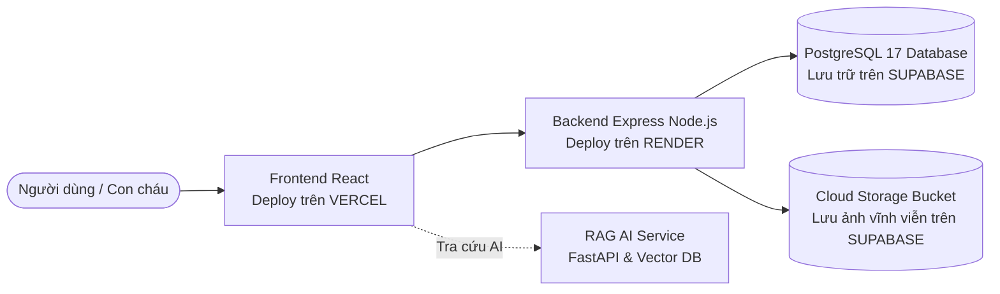

# Cổng Thông Tin & Gia Phả Dòng Họ Lê Văn (Chi 2 - Phái 4)

Hệ thống **Cổng thông tin & Gia phả số hóa** dòng họ **Lê Văn (Chi 2 - Phái 4)** — Thôn An Lợi, Xã Triệu Bình, Tỉnh Quảng Trị.

Dự án kết hợp công nghệ web hiện đại với trí tuệ nhân tạo (**RAG - Retrieval Augmented Generation**) nhằm bảo tồn truyền thống tổ tiên, số hóa cây gia phả tương tác đa thế hệ, cập nhật tin tức, tư liệu dòng họ, đồng thời hỗ trợ con cháu tra cứu cội nguồn nhanh chóng qua **Trợ lý AI dòng họ**.

---

## 1. Kiến trúc Triển khai Cloud (0 VNĐ / Tháng)

Hệ thống vận hành trực tuyến 24/7 hoàn toàn miễn phí trên nền tảng Cloud hiện đại:



### Phân công hạ tầng:
- **Frontend (Vercel)**: React 18, Vite 5, TypeScript, Tailwind CSS, `@xyflow/react`.
- **Backend API (Render)**: Node.js 22, Express.js, TypeScript, PostgreSQL client (`pg`), `@supabase/storage-js`.
- **Database & Storage (Supabase)**: PostgreSQL 17 (kết nối qua Connection Pooler SSL) và Supabase Storage (lưu trữ ảnh đại diện, ảnh tin tức vĩnh viễn).
- **Trợ lý AI Tra cứu (RAG Service)**: Python FastAPI, LangChain, ChromaDB, Ollama (`qwen2.5:7b`).

---

## 2. Tính năng Nổi bật

- **Cây Gia Phả Tương Tác Trực Quan**:
  - Tự động phân tầng thế hệ theo từng đời con cháu.
  - Phân nhánh rõ ràng con cái theo từng đời vợ (*Chánh phối, Thứ phối, Thứ thứ phối...*).
  - Thống kê thời gian thực: Tổng số thành viên, số người còn sống, số người đã mất.
  - Tích hợp công cụ cắt xén ảnh chân dung bo tròn (`react-easy-crop`) trước khi tải lên.
  - Cơ chế dự phòng dữ liệu ngoại tuyến (Static Fallback) đảm bảo trang web luôn hiển thị mượt mà.
- **Bản Tin & Sự Kiện Dòng Họ**: Đăng tải tin tức, thông báo ngày giỗ tổ, lễ hội truyền thống, khuyến học.
- **Tư Liệu & Văn Bản Lịch Sử**: Số hóa hình ảnh sắc phong, văn tự Hán - Nôm, văn cúng, bài văn tế.
- **Đố Vui Gia Phả (Quiz)**: Trắc nghiệm tương tác giúp thế hệ trẻ tìm hiểu cội nguồn dòng họ.
- **Trợ Lý AI Dòng Họ**: Giải đáp câu hỏi về phả hệ, danh xưng vai vế, ngày giỗ và mộ phần tổ tiên.

---

## 3. Cấu trúc Thư mục Dự án

```
Portal-HoLeVan-Phai4-Chi2/
├── .env.example                      # File mẫu biến môi trường chuẩn (không chứa mã mật)
├── .gitignore                        # Cấu hình bỏ qua file nhạy cảm và thư mục build
├── admin.txt                         # Thông tin tài khoản quản trị nội bộ (được gitignore bảo vệ)
├── docker-compose.yml                # Cấu hình khởi chạy toàn bộ hệ thống cục bộ với PostgreSQL
├── README.md                         # Tài liệu giới thiệu & hướng dẫn dự án
│
├── backend/                          # BACKEND SERVICE (Node.js/Express + TypeScript)
│   ├── src/
│   │   ├── config/                   # db.ts (PostgreSQL Pool), initSql.ts, seed_members.ts
│   │   ├── controllers/              # authController, membersController, newsController
│   │   ├── data/members.json         # Dữ liệu 300+ thành viên gia phả đóng gói sẵn
│   │   ├── middleware/               # Xác thực JWT (auth.ts), Upload ảnh Supabase (upload.ts)
│   │   ├── routes/                   # Khai báo endpoints (/api/auth, /api/members, /api/news)
│   │   └── server.ts                 # Điểm khởi động Express server
│   ├── Dockerfile                    # Container hóa Backend trên nền Node 22 Alpine
│   └── package.json
│
├── frontend/                         # FRONTEND WEB (React 18 + Vite + TypeScript)
│   ├── src/
│   │   ├── components/               # Cây gia phả (FamilyTree), Chatbot, Layout, Modals
│   │   ├── data/members.json         # Dữ liệu gia phả tĩnh dự phòng
│   │   ├── pages/                    # Trang chủ, Cây gia phả, Tin tức, Tư liệu, Đố vui
│   │   └── services/                 # Kết nối API linh hoạt qua VITE_API_URL
│   ├── vercel.json                   # Cấu hình Rewrite định tuyến SPA trên Vercel
│   ├── Dockerfile
│   └── package.json
│
└── rag-service/                      # AI MICROSERVICE (FastAPI + LangChain + ChromaDB)
    ├── src/main.py                   # FastAPI server & RAG pipeline
    ├── Dockerfile
    └── requirements.txt
```

---

## 4. Hướng dẫn Khởi chạy Cục bộ (Local Development)

### Cách 1: Chạy bằng Docker Compose (Khuyên dùng)
Yêu cầu máy tính đã cài đặt Docker Desktop:

```bash
# Khởi chạy toàn bộ hệ thống (PostgreSQL, Backend, Frontend, RAG Service)
docker compose up -d --build

# Xem log hoạt động
docker compose logs -f
```

- **Frontend**: [http://localhost:3000](http://localhost:3000)
- **Backend API**: [http://localhost:5000](http://localhost:5000)
- **Database PostgreSQL**: `localhost:5432`

### Cách 2: Khởi chạy thủ công từng phần

```bash
# Backend
cd backend
npm install
npm run dev

# Frontend (mở terminal mới)
cd frontend
npm install
npm run dev
```

---

## 5. Hướng dẫn Triển khai Trực tuyến (Cloud)

1. **Database & Storage (Supabase)**: Tạo Project mới tại Singapore $\rightarrow$ Lấy `DATABASE_URL` (URI) $\rightarrow$ Tạo Storage bucket tên `uploads` (chế độ Public).
2. **Backend (Render)**: Tạo Web Service từ GitHub $\rightarrow$ Root Directory: `backend` $\rightarrow$ Thêm các biến môi trường: `DATABASE_URL`, `JWT_SECRET`, `SUPABASE_URL`, `SUPABASE_SERVICE_ROLE_KEY`, `SUPABASE_STORAGE_BUCKET=uploads`.
3. **Frontend (Vercel)**: Import repo $\rightarrow$ Root Directory: `frontend` $\rightarrow$ Thêm biến môi trường `VITE_API_URL` trỏ về link Render kèm `/api`.

---

## 6. Bảo mật & Quản trị Hệ thống

- **Thông tin tài khoản Quản trị viên (Admin)** mặc định được lưu trữ trong file nội bộ `admin.txt` tại thư mục gốc của dự án.
- File `admin.txt` và file `.env` đã được cấu hình trong `.gitignore` để bảo đảm **không bao giờ bị lộ lên GitHub**.
- Sau khi đăng nhập quản trị lần đầu, vui lòng đổi mật khẩu tài khoản cá nhân để tăng cường bảo mật.