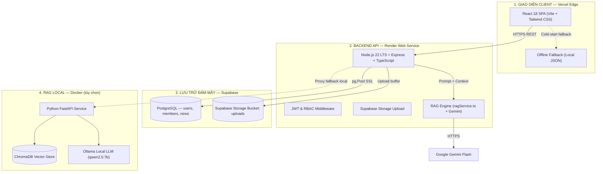
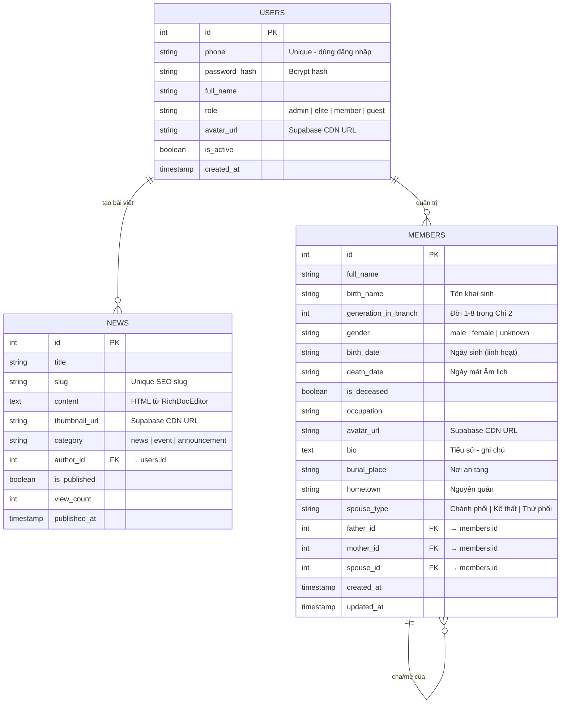

# Cổng Thông Tin & Gia Phả Số Hóa Dòng Họ Lê Văn - Phái 4 - Chi 2

> **Website chính thức:** [https://portal-holevan-phai4-chi2.vercel.app/](https://portal-holevan-phai4-chi2.vercel.app/)  
> **Backend API:** [https://portal-holevan-phai4-chi2.onrender.com](https://portal-holevan-phai4-chi2.onrender.com)

---

## 📖 Mục Lục

1. [Giới thiệu Dự án](#-giới-thiệu-dự-án)
2. [Kiến trúc Hệ thống](#-kiến-trúc-hệ-thống)
3. [Các Tính Năng Chính](#-các-tính-năng-chính)
4. [Cơ Sở Dữ Liệu](#-cơ-sở-dữ-liệu-postgresql)
5. [Cấu Trúc Thư Mục](#-cấu-trúc-thư-mục)
6. [Biến Môi Trường](#-biến-môi-trường)
7. [Triển Khai Production](#-triển-khai-production)
8. [Chạy Local với Docker](#-chạy-local-với-docker)
9. [Bản Quyền & Bảo Mật](#-bản-quyền--bảo-mật)

---

## 📖 Giới thiệu Dự án

Dự án **Portal Họ Lê Văn - Phái 4 - Chi 2** là nền tảng số hóa di sản dòng họ toàn diện, kết hợp công nghệ web hiện đại với trí tuệ nhân tạo thế hệ mới (**RAG - Retrieval Augmented Generation**).

Hệ thống quản lý dữ liệu **hơn 313 thành viên trải qua 8 thế hệ** (Đời 9 đến Đời 16 của Phái 4 Họ Lê Văn tại An Lợi, Triệu Bình, Quảng Trị), với 4 phân hệ chính:

- 🔴 **Gia phả số**: Cây phả hệ trực quan, phân tầng theo đời, quản lý toàn bộ quan hệ huyết thống.
- 🟡 **Lịch giỗ kỵ**: Sổ kỵ nhật tiền nhân 12 tháng Âm lịch, tự động cập nhật khi sửa gia phả.
- 🟢 **Tư liệu - Sự kiện**: Tin tức, hoạt động, thông báo, tài liệu lịch sử họ tộc (gộp chung một mục).
- 🔵 **Trợ lý AI dòng họ**: Tra cứu gia phả thông minh qua hội thoại tự nhiên.

---

## 🏛️ Kiến trúc Hệ thống

Mô hình kiến trúc phân tán (**Decoupled Architecture**), vận hành **24/7 miễn phí** trên Cloud:



---

## ✨ Các Tính Năng Chính

### 1. Cây Gia Phả Tương Tác (`FamilyTreePage.tsx`)
- **Thuật toán phân tầng tự động**: Tọa độ Y = `(generation - 1) × ΔY`; tọa độ X chống chồng lấn tự động theo bề rộng nhánh con cái.
- **Đa hôn phối**: Hiển thị Chánh phối, Kế thất, Thứ phối cạnh nhau; đường kết nối đúng cặp cha/mẹ → con.
- **Search & Auto-Focus**: Nhập tên → pan và zoom tập trung đúng vị trí trên cây.
- **Offline Fallback**: Khi Backend cold-start hoặc mất mạng, tự động nạp `members.json` cục bộ.
- **Admin Panel**: Thêm/sửa/xóa thành viên, upload ảnh chân dung với crop tỉ lệ 1:1 (`react-easy-crop`).

### 2. Lịch Giỗ Kỵ 12 Tháng Âm Lịch (`MemorialCalendarPage.tsx`)
- Danh sách 109+ vị tiền nhân đã quy tiên, phân nhóm theo 12 tháng Âm lịch.
- **Quy ước phong tục**: Ngày cúng giỗ = ngày mất − 1 (ví dụ: mất 10/01 → giỗ 09/01 Âm lịch).
- **Tự động đồng bộ**: Khi Admin sửa `death_date` hoặc `is_deceased` trong Gia phả → Lịch giỗ cập nhật ngay.
- Tìm kiếm đa trường: họ tên, đời thứ, tên cha/mẹ, nơi an táng.

### 3. Tư Liệu - Sự Kiện Dòng Họ (`NewsPage.tsx`)
- Đăng bài, chỉnh sửa, xóa bài viết với trình soạn thảo phong phú (`RichDocEditor`) hỗ trợ paste ảnh trực tiếp (`Ctrl+V`).
- Upload ảnh bìa với công cụ cắt ảnh (`react-easy-crop`) hỗ trợ nhiều tỉ lệ: 16:9 (Chuẩn bìa), 4:3, 1:1 (Vuông) hoặc Tự do.
- Hiển thị tên tác giả đăng bài rõ ràng và chuẩn xác.
- Tự động phục vụ ảnh qua CDN Supabase Storage và fallback tĩnh Nginx trên môi trường Docker cục bộ.
- Tất cả bài viết và tư liệu đều dùng chung bảng `news`, phân loại qua `category`.

### 4. Hệ Thống Phân Quyền & Bài Test Nâng Hạng (`UserProfileModal.tsx`)
- **Phân cấp vai trò rõ ràng**:
  - 👑 **Quản trị viên (`admin`)**: Toàn quyền quản trị hệ thống, quản lý phả hệ, thêm/sửa/xóa bài viết.
  - ⭐ **Thành viên ưu tú (`elite`)**: Được cấp quyền đăng bài viết mới trong mục Tư liệu - Sự kiện.
  - 👤 **Thành viên tiêu chuẩn (`member`)**: Xem thông tin, lịch kỵ nhật, tra cứu gia phả và chat cùng AI.
- **Bài kiểm tra kiến thức dòng họ**:
  - Tích hợp ngay trong cửa sổ thông tin tài khoản (click vào tên góc phải trên thanh điều hướng).
  - Gồm bộ 10 câu hỏi trắc nghiệm tìm hiểu về nguồn cội, tiền nhân và truyền thống dòng họ Lê Văn Phái 4 - Chi 2.
  - Làm đúng từ **5/10 câu trở lên** sẽ được tự động nâng cấp vai trò lên **Thành viên ưu tú**.

### 5. Trợ Lý AI Gia Phả (RAG Engine)
- **In-Backend RAG** (`ragService.ts`): Không cần container Python riêng, hoạt động hoàn toàn trong Backend Node.js.
- **Kho tri thức** (`backend/src/data/knowledge/`): 3 file Markdown chuẩn hóa về lịch sử dòng họ, kỵ nhật, và hồ sơ thành viên.
- **Hybrid retrieval**: Phân tích tên thành viên → mở rộng quan hệ (cha, mẹ, vợ/chồng, con) → trích lọc ngữ cảnh kỵ nhật → gửi Gemini Flash.
- **Exponential Backoff**: Tự động thử lại khi gặp lỗi 429/503 từ Google AI Studio.
- **Python RAG Service** (tùy chọn, chỉ dùng cho Local): FastAPI + LangChain + ChromaDB + Ollama.

---

## 🗄️ Cơ Sở Dữ Liệu (PostgreSQL)

Chỉ 3 bảng nghiệp vụ thực tế, không có bảng thừa:



---

## 📁 Cấu Trúc Thư Mục

```
Portal-HoLeVan-Phai4-Chi2/
├── .env.example                    # Mẫu khai báo biến môi trường
├── .gitignore
├── docker-compose.yml              # Khởi chạy đa container cục bộ
├── README.md
│
├── backend/                        # Backend API (Node.js 22 / Express / TypeScript)
│   ├── migrate_cleanup.sql         # Script xóa bảng cũ trên Supabase (chạy 1 lần)
│   ├── src/
│   │   ├── config/
│   │   │   ├── db.ts               # PostgreSQL Pool (SSL) + initDb()
│   │   │   ├── initSql.ts          # Schema 3 bảng: users, members, news
│   │   │   ├── init_postgres.sql   # Schema SQL (bản SQL thuần)
│   │   │   ├── seed_members.ts     # Nạp 313 thành viên nếu bảng trống
│   │   │   └── seed_news.ts        # Nạp bài viết mẫu nếu bảng trống
│   │   ├── controllers/
│   │   │   ├── authController.ts   # Đăng nhập, JWT
│   │   │   ├── membersController.ts# CRUD thành viên gia phả
│   │   │   ├── memorialsController.ts # Tính toán & trả kỵ nhật động
│   │   │   ├── newsController.ts   # CRUD bài viết / tư liệu
│   │   │   └── chatController.ts   # Điều phối RAG + AI Chat
│   │   ├── middleware/
│   │   │   ├── auth.ts             # verifyToken & requireAdmin (JWT RBAC)
│   │   │   └── upload.ts           # Multer + Supabase Storage CDN
│   │   ├── routes/
│   │   │   ├── auth.ts
│   │   │   ├── members.ts
│   │   │   ├── memorials.ts
│   │   │   ├── news.ts
│   │   │   └── chat.ts
│   │   ├── services/
│   │   │   └── ragService.ts       # In-Backend RAG Engine + Gemini Flash
│   │   ├── data/
│   │   │   ├── members.json        # Seed data 313 thành viên
│   │   │   ├── news.json           # Seed data bài viết mẫu
│   │   │   └── knowledge/          # 3 file Markdown tri thức cho RAG
│   │   │       ├── gia_pha_chi_tiet_ho_le_van.md
│   │   │       ├── lich_gio_ky_va_an_tang.md
│   │   │       └── tong_quan_va_thong_ke_dong_ho.md
│   │   └── server.ts               # Điểm khởi chạy Express
│   ├── scripts/
│   │   └── copy_knowledge.js       # Copy Markdown vào dist/ khi build
│   ├── Dockerfile
│   ├── package.json
│   └── tsconfig.json
│
├── frontend/                       # Giao diện (React 18 / Vite / TypeScript / Tailwind)
│   ├── src/
│   │   ├── components/
│   │   │   ├── FamilyTree/         # @xyflow/react: MemberNode, TreeControls, layoutEngine
│   │   │   ├── Chatbot/            # Widget AI Chat nổi
│   │   │   ├── Layout/             # Header, Footer, Navbar
│   │   │   ├── News/               # NewsCard, RichDocEditor
│   │   │   └── common/             # LoadingSpinner, ...
│   │   ├── pages/
│   │   │   ├── HomePage.tsx            # Trang chủ & 4 thẻ điều hướng
│   │   │   ├── FamilyTreePage.tsx      # Cây gia phả tương tác
│   │   │   ├── MemorialCalendarPage.tsx# Lịch giỗ kỵ 12 tháng
│   │   │   ├── NewsPage.tsx            # Danh sách tư liệu - sự kiện
│   │   │   └── NewsDetailPage.tsx      # Chi tiết bài viết
│   │   ├── services/
│   │   │   ├── api.ts              # Axios base instance (VITE_API_URL)
│   │   │   ├── authService.ts      # Đăng nhập / đăng xuất
│   │   │   ├── memberService.ts    # CRUD thành viên, upload avatar
│   │   │   └── newsService.ts      # CRUD bài viết, fallback JSON
│   │   ├── store/
│   │   │   └── authStore.ts        # Zustand: JWT + user info
│   │   ├── data/
│   │   │   ├── members.json        # Offline fallback data
│   │   │   ├── memorials.json      # Offline fallback kỵ nhật
│   │   │   └── news.json           # Offline fallback bài viết
│   │   ├── types/index.ts          # TypeScript interfaces
│   │   ├── hooks/                  # useChat, ...
│   │   └── utils/                  # cropImage, ...
│   ├── vercel.json                 # SPA routing config
│   ├── Dockerfile
│   ├── package.json
│   └── vite.config.ts
│
└── rag-service/                    # Python RAG Service (tùy chọn — chỉ dùng Local)
    ├── src/
    │   ├── main.py                 # FastAPI server
    │   ├── ingest.py               # Vector hóa tài liệu → ChromaDB
    │   ├── rag_pipeline.py         # LangChain + ChromaDB + Ollama/Gemini
    │   ├── config.py               # Pydantic Settings
    │   └── models.py               # Pydantic Schemas
    ├── scripts/
    │   └── generate_rag_documents.py # Tạo Markdown từ members.json
    ├── data/raw_documents/
    ├── Dockerfile
    └── requirements.txt
```

---

## 🔐 Biến Môi Trường

### Backend (`backend` — cấu hình trên Render hoặc `.env`)

| Tên Biến | Bắt Buộc | Ý Nghĩa |
|---|:---:|---|
| `DATABASE_URL` | ✅ | Chuỗi kết nối PostgreSQL Supabase (Pooler Transaction) |
| `JWT_SECRET` | ✅ | Khóa bí mật ký JWT (tối thiểu 32 ký tự) |
| `SUPABASE_URL` | ✅ | `https://[project-ref].supabase.co` |
| `SUPABASE_SERVICE_ROLE_KEY` | ✅ | Khóa `service_role` để ghi file vào Storage |
| `SUPABASE_STORAGE_BUCKET` | ✅ | Tên bucket (mặc định: `uploads`) |
| `GEMINI_API_KEY` | ✅ | Lấy từ [Google AI Studio](https://aistudio.google.com/) |
| `PORT` | Không | Cổng server (mặc định: `5000`) |
| `NODE_ENV` | Không | `production` hoặc `development` |

### Frontend (`frontend` — cấu hình trên Vercel)

| Tên Biến | Bắt Buộc | Ý Nghĩa |
|---|:---:|---|
| `VITE_API_URL` | ✅ | URL Backend API, ví dụ: `https://portal-holevan-phai4-chi2.onrender.com/api` |

---

## 🚀 Triển Khai Production

### Bước 1: Chuẩn bị Supabase Cloud
1. Đăng ký tại [supabase.com](https://supabase.com/) → Tạo Project mới.
2. **Database** → **Connection Pooling** → Sao chép URI kết nối dạng `Transaction`.
3. **Storage** → **New Bucket** → Đặt tên `uploads` → Bật **Public bucket** → Save.
4. **Project Settings** → **API** → Sao chép `Project URL` và `service_role` key.

### Bước 2: Triển khai Backend trên Render
1. [Render Dashboard](https://dashboard.render.com/) → **New** → **Web Service** → Kết nối GitHub repo.
2. Cấu hình:
   - **Root Directory:** `backend`
   - **Build Command:** `npm install && npm run build`
   - **Start Command:** `npm start`
   - **Plan:** Free
3. Thêm tất cả biến môi trường Backend vào mục **Environment**.
4. Deploy → Sao chép URL được cấp.

### Bước 3: Triển khai Frontend trên Vercel
1. [Vercel Dashboard](https://vercel.com/) → **Add New Project** → Import GitHub repo.
2. Cấu hình:
   - **Framework:** `Vite`
   - **Root Directory:** `frontend`
3. Thêm biến: `VITE_API_URL` = `https://<ten-render-service>.onrender.com/api`
4. Deploy.

---

## 💻 Chạy Local với Docker

> Yêu cầu: **Docker Desktop** đã cài đặt.

```bash
# Clone về máy
git clone https://github.com/LGKAI/Portal-HoLeVan-Phai4-Chi2.git
cd Portal-HoLeVan-Phai4-Chi2

# Khởi chạy toàn bộ hệ thống (PostgreSQL + Backend + Frontend + RAG Service)
docker compose up -d --build

# Xem log
docker compose logs -f
```

**Địa chỉ truy cập:**
| Dịch vụ | URL |
|---|---|
| Giao diện Frontend | http://localhost:3000 |
| Backend API | http://localhost:5000 |
| Python RAG Service | http://localhost:8000 |
| PostgreSQL | localhost:5432 |

**Tài khoản Admin mặc định:**
- Số điện thoại: `0901234567`
- Mật khẩu: `Admin@123456`

---

## 🛡️ Bản Quyền & Bảo Mật

**Quyền Sở Hữu Dữ Liệu:**
> Toàn bộ dữ liệu phả hệ, thông tin thân tộc, hình ảnh và vị trí mồ mả thuộc quyền sở hữu thiêng liêng của Hội đồng Gia tộc **Họ Lê Văn - Phái 4 - Chi 2**, Thôn An Lợi, Xã Triệu Bình, Huyện Triệu Phong, Tỉnh Quảng Trị.

**Nguyên Tắc Bảo Mật:**
- Tuyệt đối không lưu mật khẩu, khóa API, hay chuỗi kết nối trong mã nguồn hoặc lịch sử commit.
- Tất cả credential được quản lý qua biến môi trường độc lập trên từng nền tảng.
- Mật khẩu người dùng được băm bằng **Bcrypt** (salt rounds = 10).
- Phân quyền nghiêm ngặt qua **JWT + RBAC** (`admin` / `member` / `guest`).