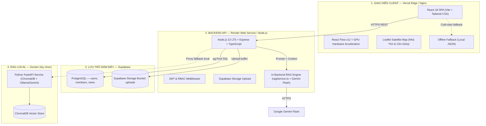
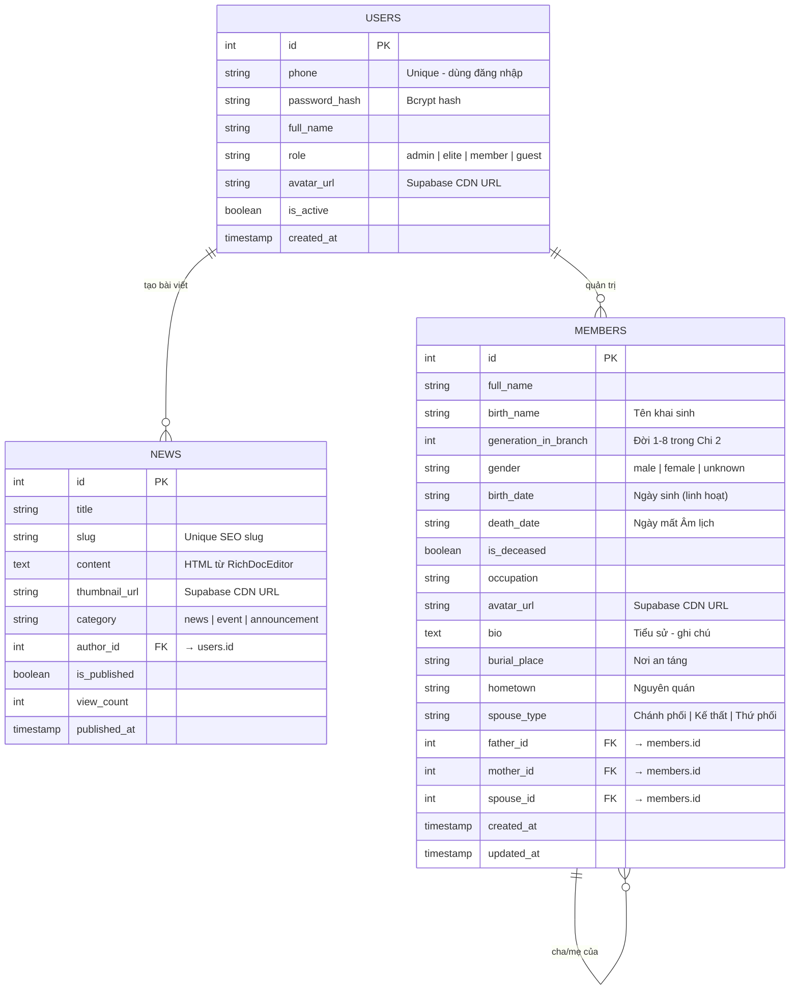

# Cổng Thông Tin & Gia Phả Số Hóa Dòng Họ Lê Văn - Phái 4 - Chi 2

> **Website chính thức:** [https://portal-holevan-phai4-chi2.vercel.app/](https://portal-holevan-phai4-chi2.vercel.app/)  
> **Backend API:** [https://portal-holevan-phai4-chi2.onrender.com](https://portal-holevan-phai4-chi2.onrender.com)

---

## 📖 Mục Lục

1. [Giới thiệu Dự án](#-giới-thiệu-dự-án)
2. [Kiến trúc Hệ thống](#-kiến-trúc-hệ-thống)
3. [Các Tính Năng Chính](#-các-tính-năng-chính)
4. [Cơ Sở Dữ Liệu](#-cơ-sở-dữ-liệu-postgresql)
5. [Cấu Trúc Thư Mục](#-cấu-trúc-thư-mục)
6. [Biến Môi Trường](#-biến-môi-trường)
7. [Triển Khai Production](#-triển-khai-production)
8. [Chạy Local với Docker](#-chạy-local-với-docker)
9. [Bản Quyền & Bảo Mật](#-bản-quyền--bảo-mật)

---

## 📖 Giới thiệu Dự án

Dự án **Portal Họ Lê Văn - Phái 4 - Chi 2** là nền tảng số hóa di sản dòng họ toàn diện, kết hợp công nghệ web hiện đại với trí tuệ nhân tạo thế hệ mới (**RAG - Retrieval Augmented Generation**).

Hệ thống quản lý dữ liệu **hơn 321 thành viên trải qua 8 thế hệ** (Đời 9 đến Đời 16 của Phái 4 Họ Lê Văn tại Thôn An Lợi, Xã Triệu Bình, Tỉnh Quảng Trị), với 5 phân hệ chính:

- 🔴 **Gia phả số**: Cây phả hệ trực quan đa tầng, tối ưu phần cứng GPU 60–120 FPS trên di động & máy tính bảng, quản lý toàn bộ quan hệ huyết thống và hôn phối.
- 🟡 **Lịch giỗ kỵ**: Sổ kỵ nhật tiền nhân 12 tháng Âm lịch, tự động tính toán và đồng bộ khi cập nhật gia phả, giao diện cân xứng trên iPad.
- 🟣 **Bản đồ Cội Nguồn Dòng Tộc**: Bản đồ số hóa vệ tinh tương tác cao cấp (Leaflet GIS) định vị Nhà Thờ Họ và Khu Lăng Mộ Cồn Giữa kèm chỉ đường GPS tận nơi.
- 🟢 **Tư liệu - Sự kiện**: Tin tức, hoạt động, thông báo, tài liệu lịch sử họ tộc kèm phân quyền tác giả.
- 🔵 **Trợ lý AI dòng họ**: Tra cứu gia phả thông minh qua hội thoại tự nhiên với kho tri thức chuyên sâu và cam kết Zero-Hallucination.

---

## 🏛️ Kiến trúc Hệ thống

Mô hình kiến trúc phân tán (**Decoupled Architecture**), vận hành **24/7 miễn phí** trên Cloud:


```mermaid
flowchart TB
    subgraph ClientTier["1. GIAO DIỆN CLIENT — Vercel Edge / Nginx"]
        UI["React 18 SPA (Vite + Tailwind CSS)"]
        TreeEngine["React Flow v12 + GPU Hardware Acceleration"]
        LeafletGIS["Leaflet Satellite Map (Nhà Thờ & Cồn Giữa)"]
        OfflineFallback["Offline Fallback (Local JSON)"]
    end

    subgraph APITier["2. BACKEND API — Render Web Service / Node.js"]
        API["Node.js 22 LTS + Express + TypeScript"]
        AuthMid["JWT & RBAC Middleware"]
        UploadMid["Supabase Storage Upload"]
        RAGCore["In-Backend RAG Engine (ragService.ts + Gemini Flash)"]
    end

    subgraph DataTier["3. LƯU TRỮ ĐÁM MÂY — Supabase"]
        PG[("PostgreSQL — users, members, news")]
        Storage[("Supabase Storage Bucket: uploads")]
    end

    subgraph FallbackTier["4. RAG LOCAL — Docker (tùy chọn)"]
        FastAPIApp["Python FastAPI Service (ChromaDB + Ollama/Gemini)"]
        VectorDB[("ChromaDB Vector Store")]
    end

    UI -->|HTTPS REST| API
    UI -.->|Cold-start fallback| OfflineFallback
    API -->|pg.Pool SSL| PG
    API -->|Upload buffer| Storage
    API -->|Prompt + Context| RAGCore
    RAGCore -->|HTTPS| GeminiAI["Google Gemini Flash"]
    API -.->|Proxy fallback local| FastAPIApp
    FastAPIApp --> VectorDB
```

---

## ✨ Các Tính Năng Chính

### 1. Cây Gia Phả Tương Tác & Tối Ưu Hiệu Năng 60–120 FPS (`FamilyTreePage.tsx`, `TreeCanvas.tsx`, `MemberNode.tsx`)
- **Thuật toán phân tầng tự động**: Tọa độ Y = `(generation - 1) × ΔY`; tọa độ X chống chồng lấn tự động theo bề rộng nhánh con cái.
- **Đa hôn phối chuẩn mực**: Hiển thị Chánh phối, Thứ phối, Thứ thứ phối cạnh nhau; đường kết nối phân tầng riêng biệt theo từng cặp cha/mẹ → con.
- **Tối ưu hóa hiệu năng di động đột phá**:
  - **Triệt tiêu Layout Thrashing**: Bộ nhớ đệm kích thước khung nhìn (`containerSizeRef`) và đồng bộ vị trí cuộn qua `requestAnimationFrame`, loại bỏ 100% hiện tượng khựng lag khi vuốt ngón tay trên điện thoại.
  - **Tăng tốc phần cứng GPU**: Bổ sung `contain: layout style paint;`, `will-change: transform`, `transform: translateZ(0)` trong CSS cách ly toàn bộ cây gia phả.
  - **Memoization toàn diện**: Bọc `React.memo(MemberNode)` và `useCallback` cho toàn bộ các handler thao tác phả hệ, ngăn chặn re-render dây chuyền.
  - **Ẩn thanh cuộn desktop trên di động**: Màn hình `<= 768px` tự động ẩn thanh cuộn chuột để ưu tiên cử chỉ chạm vuốt (pan) và phóng to/thu nhỏ (pinch-to-zoom) trực tiếp.
- **Search & Auto-Focus**: Nhập tên → pan và zoom tự động định vị đúng vị trí tiền nhân trên cây.
- **Thống kê linh hoạt**: Bảng thống kê tổng số thành viên, số người đã mất, còn sống với chế độ co gọn thông minh trên di động.
- **Offline Fallback**: Khi Backend cold-start hoặc gặp sự cố mạng, tự động nạp `members.json` cục bộ.
- **Admin Panel**: Thêm/sửa/xóa thành viên, upload ảnh chân dung với công cụ cắt ảnh tỉ lệ 1:1 (`react-easy-crop`).

### 2. Lịch Giỗ Kỵ 12 Tháng Âm Lịch (`MemorialCalendarPage.tsx`)
- Danh sách hơn 109 vị tiền nhân đã quy tiên, phân nhóm theo 12 tháng Âm lịch.
- **Quy ước phong tục họ tộc**: Ngày cúng giỗ = Ngày mất − 1 (ví dụ: ngày mất 10/01 → ngày giỗ 09/01 Âm lịch).
- **Tự động đồng bộ**: Khi Quản trị viên cập nhật `death_date` hoặc `is_deceased` trong Gia phả → Lịch giỗ kỵ tự động phản ánh tức thì.
- **Giao diện chuẩn iPad & Di động**: 14 nút chọn tháng âm lịch chia thành 2 hàng x 7 cột (`grid-cols-7`) cân đối hoàn hảo trên iPad; bảng dữ liệu tự căn chỉnh chiều rộng không bị ép thanh cuộn ngang khó chịu.
- Tìm kiếm đa năng: họ tên, đời thứ, tên thân phụ/thân mẫu, nơi an táng.

### 3. Bản Đồ Cội Nguồn Dòng Tộc & Chỉ Đường GPS (`AncestralMapSection.tsx`, `MapPage.tsx`)
- **Tích hợp bản đồ vệ tinh chuyên sâu**: Sử dụng thư viện Leaflet GIS kết hợp lớp ảnh vệ tinh độ phân giải cao Google Maps Satellite Hybrid.
- **Định vị 2 địa điểm tâm linh thiêng liêng của dòng họ**:
  - 🏛️ **Nhà Thờ Họ Lê Văn**: Thôn An Lợi, Xã Triệu Bình, Tỉnh Quảng Trị (GPS: `16.825772, 107.141450`) — chốn từ đường phụng tự và tổ chức các kỳ tế lễ truyền thống.
  - 🪦 **Lăng Mộ Chi 2 - Phái 4 - Họ Lê Văn tại Cồn Giữa**: GPS: `16.830898, 107.144187` — nơi an nghỉ thiên thu của Ngài Thủy tổ Lê Văn Khôi, Cụ bà Phan Thị Mưu cùng 88 vị tiền nhân liệt tổ liệt tông.
- **Trải nghiệm tương tác mượt mà**:
  - Cuộn chuột trực tiếp trên khung bản đồ để thu phóng (không cần giữ phím Ctrl).
  - Marker huy hiệu rực rỡ với hiệu ứng radar quét xung quanh (pulsing beacon) và nhãn vị trí nổi bật.
  - Phím tắt thu phóng, căn giữa vị trí và sao chép nhanh tọa độ GPS 1-click.
  - Nút **"Chỉ đường về tận nơi"** tự động mở ứng dụng Google Maps dẫn đường trực tiếp trên điện thoại/máy tính.
- **Tích hợp linh hoạt**: Xuất hiện vừa là một khối trang trọng trên Trang chủ, vừa có trang route riêng biệt `/map`.

### 4. Tư Liệu - Sự Kiện Dòng Họ (`NewsPage.tsx`, `NewsDetailPage.tsx`)
- **Trình soạn thảo chuyên nghiệp**: `RichDocEditor` hỗ trợ định dạng văn bản phong phú, dán ảnh trực tiếp từ clipboard (`Ctrl+V`).
- **Upload & Cắt ảnh bìa**: Công cụ `react-easy-crop` linh hoạt nhiều tỉ lệ: 16:9 (Chuẩn bài viết), 4:3, 1:1 (Vuông) hoặc Tự do.
- **Phân quyền tác giả minh bạch**:
  - Ghi nhận và hiển thị tác giả: *"Bài viết được đăng bởi [Tên tác giả]"*.
  - 👑 **Quản trị viên**: Đăng bài mới, phê duyệt, chỉnh sửa và xóa bài viết.
  - ⭐ **Thành viên ưu tú**: Được cấp quyền viết và gửi bài mới (bài viết chờ Quản trị viên duyệt trước khi hiển thị công khai).
  - 👤 **Thành viên tiêu chuẩn**: Xem bài viết, có lời nhắc nâng cấp tài khoản để mở khóa quyền đóng góp bài viết.
- **Lưu trữ & Phục vụ ảnh**: Phục vụ qua CDN Supabase Storage trên Cloud và Nginx tĩnh trên môi trường Docker.

### 5. Thông Điệp Từ Người Phát Triển (`DeveloperMessageSection.tsx`)
- Khu vực tự sự trang trọng của người sáng lập & phát triển hệ thống — **Lê Gia Khánh** (con cháu Chi 2 - Phái 4), chia sẻ tâm nguyện gìn giữ gia phả thiêng liêng, hướng về nguồn cội quê hương An Lợi, Triệu Bình, Quảng Trị.

### 6. Hệ Thống Tài Khoản, Phân Quyền & Bài Test Nâng Hạng (`UserProfileModal.tsx`, `Navbar.tsx`)
- **Phân cấp vai trò rõ ràng (3 cấp bậc)**:
  - 👑 **Trùm cuối (`admin`)**: Toàn quyền hệ thống, quản lý cây gia phả, lịch kỵ nhật và duyệt bài viết.
  - ⭐ **Thành viên ưu tú (`elite`)**: Quyền đăng bài viết mới trong mục Tư liệu - Sự kiện.
  - 👤 **Thành viên tiêu chuẩn (`member`)**: Quyền tra cứu cơ bản, tham gia làm bài test nâng cấp vai trò.
- **Hồ sơ cá nhân & Bài trắc nghiệm dòng họ**:
  - Cửa sổ User Profile trực quan khi nhấp vào tên tài khoản hoặc thẻ thông báo.
  - Bộ 10 câu hỏi trắc nghiệm A/B tìm hiểu nguồn cội, tiền nhân và truyền thống dòng họ Lê Văn Phái 4 - Chi 2.
  - Làm đúng từ **5/10 câu trở lên**: Chúc mừng và tự động thăng hạng lên **Thành viên ưu tú**.
- **Thẻ thông báo vai trò thông minh**: Ghim góc trên phải trang chủ, tự động co gọn trên màn hình di động để không đè chữ tiêu đề.

### 7. Trợ Lý AI Gia Phả (RAG Engine & Floating Chatbot)
- **Thiết kế biểu tượng Chatbot sang trọng**:
  - Nút bấm AI nổi bật với ảnh Robot 3D tông màu Đỏ - Vàng kim (`/ai-robot.jpg`), đèn báo trạng thái xanh lá trực tuyến.
  - Tối ưu vị trí cách mép phải/đáy phù hợp trên cả điện thoại (`50px`) và máy tính (`56px`).
- **In-Backend RAG Engine** (`ragService.ts`):
  - Tích hợp trực tiếp trong Node.js Backend, truy vấn kết hợp Google Gemini Flash.
  - Thuật toán mở rộng ngữ cảnh quan hệ gia phả đa chiều (thân phụ mẫu, phối ngẫu, con cái, anh chị em).
  - Cơ chế **Exponential Backoff** tự động thử lại khi gặp giới hạn tốc độ API (Rate Limit 429).
  - Chi tiết kiến trúc xem tại: [`reports/rag_chatbot.md`](reports/rag_chatbot.md).
- **Python RAG Service** (Tùy chọn Local Docker): FastAPI + ChromaDB + Ollama (`qwen2.5:7b`).

### 8. Giao Diện Người Dùng Đồng Bộ & Thẩm Mỹ (UI/UX)
- **Thanh điều hướng (Navbar)**: Đồng bộ icon và tên gọi 5 danh mục:
  - 🏠 **Trang chủ**
  - 📖 **Gia phả số**
  - 📅 **Lịch giỗ kỵ**
  - 📰 **Tư liệu - Sự kiện**
  - 📍 **Bản đồ**
  - Dòng hiển thị ngày tháng âm dương đầy đủ, rõ nét (*"Thứ Bảy, 10/10/2026 (01/09/2026 Âm lịch)"*), không bị cắt xén.
  - Menu hamburger trên thiết bị di động có lớp nền mờ tối (`backdrop-blur`) sang trọng, dễ thao tác.
- **Banner chính & Nghệ thuật chữ truyền thống**:
  - Tiêu đề **LÊ VĂN - PHÁI 4 - CHI 2** font nghệ thuật **Merienda** (Google Fonts).
  - Hai câu đối thư pháp trang nhã co dãn linh hoạt, cân đối vị trí trung tâm nổi bật trên cổng nhà thờ họ.
  - Nút bấm đôi trang nhã **"Xem Gia Phả"** và **"Xem Lịch Giỗ"**.
- **Chỉ số dòng họ**: 🏛️ **8+ Đời**, 👥 **300+ Thành viên**, 🕒 **250+ Năm lịch sử**.
- **3 Thẻ tính năng nổi bật**: Hiệu ứng chuyển động sống động, nảy nhẹ và phóng to tinh tế khi hover.
- **Chân trang (Footer)**:
  - Thông tin dòng họ, điện thoại liên hệ (📞) và liên kết (📎).
  - Cột Liên kết chia đôi gọn gàng: Cột 1 (*Trang chủ, Gia phả số, Lịch giỗ kỵ*) và Cột 2 (*Tư liệu & Sự kiện, Bản đồ*).

---

## 🗄️ Cơ Sở Dữ Liệu (PostgreSQL)

Hệ thống sử dụng cơ sở dữ liệu quan hệ tối ưu với 3 bảng chính:


```mermaid
erDiagram
    USERS ||--o{ NEWS : "tạo bài viết"
    USERS ||--o{ MEMBERS : "quản trị"
    MEMBERS ||--o{ MEMBERS : "cha/mẹ của"

    USERS {
        int id PK
        string phone "Unique - dùng đăng nhập"
        string password_hash "Bcrypt hash"
        string full_name
        string role "admin | elite | member | guest"
        string avatar_url "Supabase CDN URL"
        boolean is_active
        timestamp created_at
    }

    MEMBERS {
        int id PK
        string full_name
        string birth_name "Tên khai sinh"
        int generation_in_branch "Đời 1-8 trong Chi 2"
        string gender "male | female | unknown"
        string birth_date "Ngày sinh (linh hoạt)"
        string death_date "Ngày mất Âm lịch"
        boolean is_deceased
        string occupation
        string avatar_url "Supabase CDN URL"
        text bio "Tiểu sử - ghi chú"
        string burial_place "Nơi an táng"
        string hometown "Nguyên quán"
        string spouse_type "Chánh phối | Kế thất | Thứ phối"
        int father_id FK "→ members.id"
        int mother_id FK "→ members.id"
        int spouse_id FK "→ members.id"
        timestamp created_at
        timestamp updated_at
    }

    NEWS {
        int id PK
        string title
        string slug "Unique SEO slug"
        text content "HTML từ RichDocEditor"
        string thumbnail_url "Supabase CDN URL"
        string category "news | event | announcement"
        int author_id FK "→ users.id"
        boolean is_published
        int view_count
        timestamp published_at
    }
```

---

## 📁 Cấu Trúc Thư Mục

```
Portal-HoLeVan-Phai4-Chi2/
├── .env.example                    # Mẫu khai báo biến môi trường
├── .gitignore                      # Cấu hình bỏ qua tệp (node_modules, uploads, scripts, .env...)
├── docker-compose.yml              # Khởi chạy toàn bộ hệ thống cục bộ
├── README.md                       # Tài liệu tổng thể dự án
├── scripts/                        # Tiện ích nội bộ đồng bộ dữ liệu (được bảo vệ trong .gitignore)
│
├── backend/                        # Backend API (Node.js 22 / Express / TypeScript)
│   ├── src/
│   │   ├── config/
│   │   │   ├── db.ts               # PostgreSQL Pool (SSL) + initDb()
│   │   │   ├── initSql.ts          # Schema 3 bảng: users, members, news
│   │   │   ├── init_postgres.sql   # Schema SQL thuần
│   │   │   ├── seed_members.ts     # Nạp 321 thành viên nếu bảng trống
│   │   │   └── seed_news.ts        # Nạp bài viết mẫu nếu bảng trống
│   │   ├── controllers/
│   │   │   ├── authController.ts   # Đăng nhập, JWT, upgrade role, profile
│   │   │   ├── membersController.ts# CRUD thành viên gia phả
│   │   │   ├── memorialsController.ts # Tính toán & trả kỵ nhật động
│   │   │   ├── newsController.ts   # CRUD bài viết / tư liệu
│   │   │   └── chatController.ts   # Điều phối RAG + AI Chat
│   │   ├── middleware/
│   │   │   ├── auth.ts             # verifyToken, requireAdmin, requireEliteOrAdmin
│   │   │   └── upload.ts           # Multer + Supabase Storage CDN
│   │   ├── routes/
│   │   │   ├── auth.ts
│   │   │   ├── members.ts
│   │   │   ├── memorials.ts
│   │   │   ├── news.ts
│   │   │   └── chat.ts
│   │   ├── services/
│   │   │   └── ragService.ts       # In-Backend RAG Engine + Gemini Flash
│   │   ├── data/
│   │   │   ├── members.json        # Dữ liệu 321 thành viên
│   │   │   ├── news.json           # Dữ liệu bài viết mẫu
│   │   │   └── knowledge/          # 3 file Markdown tri thức cho RAG
│   │   │       ├── gia_pha_chi_tiet_ho_le_van.md
│   │   │       ├── lich_gio_ky_va_an_tang.md
│   │   │       └── tong_quan_va_thong_ke_dong_ho.md
│   │   └── server.ts               # Khởi chạy Express HTTP Server
│   ├── scripts/
│   │   └── copy_knowledge.js       # Sao chép Markdown vào dist/ khi build
│   ├── Dockerfile
│   ├── package.json
│   └── tsconfig.json
│
├── reports/                        # Báo cáo kỹ thuật chuyên đề
│   └── rag_chatbot.md              # Báo cáo chuyên sâu phân hệ Trợ lý AI (RAG Engine)
│
├── frontend/                       # Giao diện (React 18 / Vite / TypeScript / Tailwind)
│   ├── public/
│   │   ├── ai-robot.jpg            # Ảnh đại diện Trợ lý AI tông đỏ - vàng
│   │   ├── favicon.ico             # Logo dòng họ
│   │   ├── background.jpg          # Ảnh toàn cảnh Nhà thờ họ
│   │   └── le-gia-khanh.jpg        # Chân dung Người sáng lập & phát triển
│   ├── src/
│   │   ├── components/
│   │   │   ├── FamilyTree/         # @xyflow/react: MemberNode, TreeCanvas, layoutEngine, CustomEdges
│   │   │   ├── Home/               # AncestralMapSection.tsx, DeveloperMessageSection.tsx
│   │   │   ├── Chatbot/            # ChatbotPanel.tsx (Floating button & AI chatbox)
│   │   │   ├── Layout/             # Navbar.tsx, Footer.tsx
│   │   │   ├── Auth/               # LoginModal.tsx, RegisterModal.tsx, UserProfileModal.tsx
│   │   │   ├── News/               # NewsCard.tsx, RichDocEditor.tsx
│   │   │   └── common/             # LoadingSpinner.tsx, ScrollToTop.tsx
│   │   ├── pages/
│   │   │   ├── HomePage.tsx            # Trang chủ & các khối chức năng
│   │   │   ├── FamilyTreePage.tsx      # Cây gia phả tương tác 60-120 FPS
│   │   │   ├── MemorialCalendarPage.tsx# Lịch giỗ kỵ 12 tháng Âm lịch
│   │   │   ├── MapPage.tsx             # Bản đồ Cội Nguồn Dòng Tộc (Leaflet vệ tinh)
│   │   │   ├── NewsPage.tsx            # Danh sách tư liệu - sự kiện
│   │   │   └── NewsDetailPage.tsx      # Chi tiết bài viết
│   │   ├── services/
│   │   │   ├── api.ts              # Axios base instance
│   │   │   ├── authService.ts      # Xác thực & nâng cấp vai trò
│   │   │   ├── memberService.ts    # API thành viên
│   │   │   └── newsService.ts      # API bài viết
│   │   ├── store/
│   │   │   └── authStore.ts        # Zustand quản lý trạng thái phiên
│   │   ├── data/
│   │   │   ├── members.json        # Offline fallback phả hệ
│   │   │   ├── memorials.json      # Offline fallback kỵ nhật
│   │   │   └── news.json           # Offline fallback bài viết
│   │   ├── types/index.ts          # TypeScript interfaces
│   │   └── hooks/useChat.ts        # Hook quản lý hội thoại AI
│   ├── nginx.conf                  # Cấu hình máy chủ web Docker frontend
│   ├── Dockerfile
│   ├── package.json
│   └── vite.config.ts
│
└── rag-service/                    # Python RAG Service (Tùy chọn — Dùng cho Local Docker)
    ├── src/
    │   ├── main.py                 # FastAPI Server
    │   ├── ingest.py               # Vector hóa tài liệu → ChromaDB
    │   ├── rag_pipeline.py         # LangChain + ChromaDB + Ollama/Gemini
    │   ├── config.py               # Cấu hình Pydantic
    │   └── models.py               # Schema Pydantic
    ├── scripts/
    │   └── generate_rag_documents.py # Trích xuất JSON gia phả thành Markdown RAG
    ├── data/raw_documents/         # Dữ liệu Markdown phục vụ index
    ├── Dockerfile
    └── requirements.txt
```

---

## 🔐 Biến Môi Trường

### Backend (`backend` — cấu hình trên Render hoặc `.env`)

| Tên Biến | Bắt Buộc | Ý Nghĩa |
|---|:---:|---|
| `DATABASE_URL` | ✅ | Chuỗi kết nối PostgreSQL Supabase (Pooler Transaction) |
| `JWT_SECRET` | ✅ | Khóa bí mật ký JWT (tối thiểu 32 ký tự) |
| `SUPABASE_URL` | ✅ | `https://[project-ref].supabase.co` |
| `SUPABASE_SERVICE_ROLE_KEY` | ✅ | Khóa `service_role` ghi file vào Storage |
| `SUPABASE_STORAGE_BUCKET` | ✅ | Tên bucket (mặc định: `uploads`) |
| `GEMINI_API_KEY` | ✅ | Lấy từ [Google AI Studio](https://aistudio.google.com/) |
| `PORT` | Không | Cổng server (mặc định: `5000`) |
| `NODE_ENV` | Không | `production` hoặc `development` |

### Frontend (`frontend` — cấu hình trên Vercel hoặc `.env`)

| Tên Biến | Bắt Buộc | Ý Nghĩa |
|---|:---:|---|
| `VITE_API_URL` | ✅ | URL Backend API, ví dụ: `https://portal-holevan-phai4-chi2.onrender.com/api` |

---

## 🚀 Triển Khai Production

### Bước 1: Chuẩn bị Supabase Cloud
1. Đăng ký tại [supabase.com](https://supabase.com/) → Tạo Project mới.
2. **Database** → **Connection Pooling** → Sao chép URI kết nối dạng `Transaction`.
3. **Storage** → **New Bucket** → Đặt tên `uploads` → Bật **Public bucket** → Lưu.
4. **Project Settings** → **API** → Sao chép `Project URL` và `service_role` key.

### Bước 2: Triển khai Backend trên Render
1. [Render Dashboard](https://dashboard.render.com/) → **New** → **Web Service** → Kết nối GitHub repo.
2. Cấu hình dịch vụ:
   - **Root Directory:** `backend`
   - **Build Command:** `npm install && npm run build`
   - **Start Command:** `npm start`
   - **Plan:** Free
3. Thêm các biến môi trường Backend vào mục **Environment**.
4. Deploy và sao chép URL dịch vụ được cấp.

### Bước 3: Triển khai Frontend trên Vercel
1. [Vercel Dashboard](https://vercel.com/) → **Add New Project** → Import GitHub repo.
2. Cấu hình triển khai:
   - **Framework:** `Vite`
   - **Root Directory:** `frontend`
3. Thêm biến môi trường: `VITE_API_URL` = `https://<ten-backend-render>.onrender.com/api`
4. Deploy.

---

## 💻 Chạy Local với Docker

> Yêu cầu: Đã cài đặt **Docker Desktop**.

```bash
# 1. Clone repository về máy
git clone https://github.com/LGKAI/Portal-HoLeVan-Phai4-Chi2.git
cd Portal-HoLeVan-Phai4-Chi2

# 2. Khởi chạy toàn bộ hệ thống (PostgreSQL + Backend + Frontend + RAG Service)
docker compose up -d --build

# 3. Theo dõi log hoạt động
docker compose logs -f
```

**Danh mục dịch vụ và cổng truy cập:**
| Dịch vụ | URL | Mô tả |
|---|---|---|
| Giao diện Frontend | http://localhost:3000 | Giao diện React SPA qua Nginx |
| Backend API | http://localhost:5000 | Node.js Express REST API |
| Python RAG Service | http://localhost:8000 | FastAPI Vector Search / AI Chat |
| PostgreSQL Database | localhost:5432 | Cơ sở dữ liệu quan hệ cục bộ |

**Tài khoản Quản trị viên (Admin) mặc định:**
- Số điện thoại: `0901234567`
- Mật khẩu: `Admin@123456`
- Vai trò: 👑 **Trùm cuối**

---

## 🛡️ Bản Quyền & Bảo Mật

**Quyền Sở Hữu Dữ Liệu:**
> Toàn bộ dữ liệu phả hệ, thông tin thân tộc, hình ảnh và vị trí mộ phần thuộc quyền sở hữu thiêng liêng của Hội đồng Gia tộc **Họ Lê Văn - Phái 4 - Chi 2**, Thôn An Lợi, Xã Triệu Bình, Tỉnh Quảng Trị.

**Nguyên Tắc Bảo Mật & Đạo Đức:**
- Tuyệt đối không lưu trữ thông tin nhạy cảm, mật khẩu hoặc khóa bí mật trong mã nguồn công khai.
- Mật khẩu người dùng được băm mã hóa một chiều qua thuật toán **Bcrypt** (salt rounds = 10).
- Hệ thống phân quyền chặt chẽ thông qua **JWT + RBAC** (`admin` / `elite` / `member`).
- Trợ lý AI tuân thủ nghiêm ngặt chỉ thị tôn kính danh xưng tiền nhân và chống ảo giác thông tin.