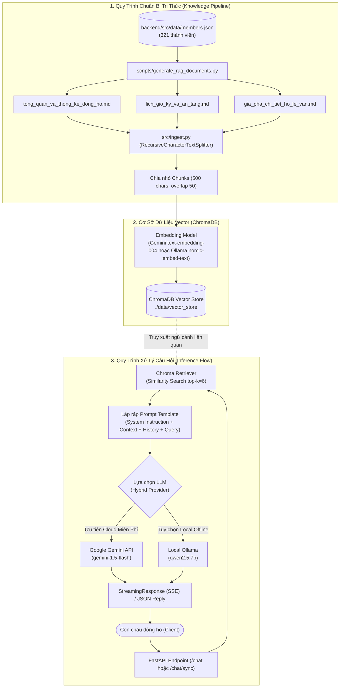

# 📜 Phân Hệ Trợ Lý Ảo Gia Phả (RAG Service)
### Dòng Họ Lê Văn - Phái 4 - Chi 2 (Thôn An Lợi, Xã Triệu Bình, Tỉnh Quảng Trị)

---

## 📌 1. Giới Thiệu Tổng Quan (Introduction)

**RAG Service** là microservice AI chuyên sâu thuộc hệ thống Cổng thông tin Gia phả Họ Lê Văn - Phái 4 - Chi 2. Module này ứng dụng kiến trúc **RAG (Retrieval-Augmented Generation - Tạo sinh tăng cường bằng truy xuất dữ liệu)**, cho phép con cháu dòng họ trò chuyện, hỏi đáp bằng ngôn ngữ tự nhiên và tra cứu chính xác, tức thì về:

- **Phả hệ & Thế thứ:** Tra cứu các đời từ Đời 1 Chi 2 (tương đương Đời 9 Phái 4) đến các thế hệ con cháu Đời 8 hiện nay (hơn 321 thành viên).
- **Ngày kỵ nhật (Lịch giỗ kỵ):** Tra cứu ngày giỗ của các bậc tiền nhân theo chuẩn Âm lịch (từ Tháng Giêng đến Tháng Chạp).
- **Mộ phần & Nơi an táng:** Tra cứu vị trí các khu nghĩa trang mồ mả tổ tiên (Cồn Giữa, Cồn Cát, Ba Lăng, Cửa Bụt...).
- **Quan hệ thân tộc:** Thân phụ mẫu, chánh phối/kế thất/thứ phối, con cái, anh chị em ruột, cành nhánh phụng tự.
- **Lịch sử & Sự nghiệp:** Danh xưng, tên húy/tên tự, chức sắc, nghề nghiệp, công đức và hành trạng cuộc đời.

> [!IMPORTANT]
> **Cam kết Chống Ảo Giác (Zero Hallucination):** Dữ liệu gia phả mang tính chất lịch sử thiêng liêng. Hệ thống được lập trình với System Prompt nghiêm ngặt: **chỉ trả lời dựa trên tư liệu đã được Hội đồng gia tộc kiểm chứng**, tôn kính xưng hô (cụ, ông, bà), và tuyệt đối từ chối phỏng đoán sai sự thật nếu dữ liệu chưa ghi nhận.

---

## 🏗️ 2. Kiến Trúc Kỹ Thuật (Architecture & Tech Stack)

Phân hệ RAG được xây dựng theo mô hình dịch vụ độc lập (Microservice), giao tiếp qua giao thức HTTP RESTful và hỗ trợ cả phản hồi đồng bộ (Sync JSON) lẫn truyền phát dòng dữ liệu thời gian thực (SSE Streaming).



### Công Nghệ Nền Tảng:
- **Ngôn ngữ & Framework:** Python 3.11, [FastAPI](https://fastapi.tiangolo.com/) (Async web server), [Uvicorn](https://www.uvicorn.org/).
- **Điều phối RAG (Orchestration):** [LangChain](https://www.langchain.com/) (`langchain`, `langchain-chroma`, `langchain-community`, `langchain-google-genai`).
- **Vector Database:** [ChromaDB](https://www.trychroma.com/) (Lưu trữ nhúng vector trực tiếp trên disk, siêu nhẹ, không cần server riêng biệt).
- **Mô hình Trí tuệ Nhân tạo (LLM) hỗ trợ linh hoạt 2 chế độ:**
  1. **Cloud Mode (Khuyên Dùng):** Google Gemini 1.5 Flash + Embedding `models/text-embedding-004` (Tốc độ cao, hoàn toàn miễn phí qua Google AI Studio API).
  2. **Local Offline Mode:** Ollama chạy cục bộ mô hình ngôn ngữ `qwen2.5:7b` (tiếng Việt rất tốt) kết hợp nhúng vector `nomic-embed-text`.

---

## 📂 3. Cấu Trúc Thư Mục (Folder Structure)

```text
rag-service/
├── .env.example                 # Mẫu cấu hình biến môi trường
├── Dockerfile                   # Kịch bản đóng gói container Docker Python 3.11-slim
├── README.md                    # Tài liệu hướng dẫn kỹ thuật chi tiết của module RAG
├── requirements.txt             # Danh sách thư viện phụ thuộc Python
├── data/
│   ├── raw_documents/           # Thư mục chứa các tài liệu tri thức markdown gốc
│   │   ├── gia_pha_chi_tiet_ho_le_van.md      # Chi tiết 321 thành viên theo từng đời
│   │   ├── lich_gio_ky_va_an_tang.md          # Lịch giỗ kỵ Âm lịch & nơi an táng
│   │   └── tong_quan_va_thong_ke_dong_ho.md   # Lịch sử, nguồn gốc An Lợi, quy ước tính đời
│   └── vector_store/            # Thư mục dữ liệu Vector ChromaDB lưu trên đĩa (persist)
├── scripts/
│   └── generate_rag_documents.py# Script tự động trích xuất JSON gia phả thành tài liệu RAG Markdown
└── src/
    ├── config.py                # Quản lý cấu hình dịch vụ (Pydantic BaseSettings)
    ├── ingest.py                # Logic đọc, phân tách (chunking) và nạp vector vào Chroma
    ├── main.py                  # Điểm khởi động FastAPI server, định nghĩa các router HTTP
    ├── models.py                # Schema Pydantic dữ liệu request/response
    └── rag_pipeline.py          # Lõi RAG: Prompt template, Chroma vector store, kết nối LLM
```

---

## 🧠 4. Cơ Chế Tri Thức & Nạp Dữ Liệu (Ingestion Engine)

Hệ thống RAG sử dụng dữ liệu hơn 321 nhân sự từ cơ sở dữ liệu gia tộc (`members.json`), sau đó chuẩn hóa thành tài liệu cấu trúc Markdown trước khi nhúng vector:

### 4.1. Sinh tài liệu tri thức (`generate_rag_documents.py`)
Khi dữ liệu gia tộc trong database được bổ sung hoặc cập nhật, script `scripts/generate_rag_documents.py` sẽ thực hiện phân tích cấu trúc cây phả hệ:
1. **Liên kết cây gia đình:** Xác định chính xác cha/mẹ, vợ/chồng, số lượng con cái và anh chị em ruột của từng thành viên.
2. **Quy ước tính thế hệ:** 
   $$\text{Đời Phái 4} = \text{Đời Chi 2} + 8$$
   *(Ví dụ: Cụ Thủy tổ Lê Văn Khôi là Đời 1 Chi 2 $\Leftrightarrow$ Đời 9 toàn Phái 4 họ Lê Văn).*
3. **Phân loại lịch giỗ Âm lịch:** Bóc tách ngày kỵ nhật từ chuỗi văn bản (ví dụ: `09/08 Âm lịch`, `12/09`, `ngày 15 tháng 7`) và sắp xếp theo 12 tháng Âm lịch từ Tháng Giêng đến Tháng Chạp.
4. **Phân vùng mộ phần:** Thống kê danh sách mộ táng tại Cồn Giữa, Cồn Cát, Ba Lăng, Cửa Bụt...

### 4.2. Kỹ thuật Phân mảnh & Nhúng Vector (`ingest.py`)
- **Text Splitter:** `RecursiveCharacterTextSplitter(chunk_size=500, chunk_overlap=50)`.
  - Giúp mỗi đoạn văn bản giữ trọn vẹn ngữ cảnh của từng cá nhân hoặc từng nhánh gia phả.
  - Độ gối đầu (overlap) 50 ký tự đảm bảo các thông tin ranh giới giữa các câu hỏi không bị cắt đứt.
- **Tự động Nạp (Auto-ingestion):** Khi FastAPI khởi động (`lifespan` trong `src/main.py`), hệ thống kiểm tra số lượng vector trong ChromaDB. Nếu vector store đang trống (`count == 0`), dịch vụ tự động đọc toàn bộ file trong `data/raw_documents` và tiến hành nạp ngay lập tức.

---

## 🎯 5. Prompt Engineering & Bộ Quy Tắc Ứng Xử Chuẩn Mực

Trọng tâm xử lý logic ngôn ngữ nằm ở `SYSTEM_PROMPT` trong `src/rag_pipeline.py`, được tinh chỉnh chống ảo giác và chuẩn hóa 100%:

```text
Bạn là Trợ lý Trí tuệ Nhân tạo tra cứu gia phả dòng họ Lê Văn - Phái 4 - Chi 2 (Thôn An Lợi, Xã Triệu Bình, Tỉnh Quảng Trị).

QUY TẮC BẮT BUỘC (TUÂN THỦ TUYỆT ĐỐI 100%):

1. MẪU TRÌNH BÀY ĐẦY ĐỦ KHI HỎI VỀ MỘT THÀNH VIÊN:
   Bất kể hỏi về ai, luôn luôn trình bày chi tiết và đồng bộ theo định dạng gạch đầu dòng chuẩn mực sau (TUYỆT ĐỐI KHÔNG TRẢ LỜI CỤT NGỦN HOẶC VIẾT THÀNH ĐOẠN VĂN NGẮN):
   Mở đầu: "Dạ thưa quý bà con dòng họ, thông tin về [Họ và tên hoặc Danh xưng + Họ và tên] trong gia phả như sau:"
   - Họ và tên: [Họ và tên đầy đủ, kèm Biệt danh/tên gọi thường trong ngoặc nếu có]
   - Thế thứ: [Đời thứ mấy Chi 2 (Đời thứ mấy Phái 4)]
   - Giới tính: [Nam / Nữ / Không rõ]
   - Tình trạng: [Còn sống (Hiện tiền) hoặc Đã mất (Quy tiên)]
   - Năm sinh: [Ngày/tháng/năm sinh, kèm năm Âm lịch nếu có]
   - Ngày mất: [Chỉ ghi nếu ĐÃ MẤT. Nếu còn sống (Hiện tiền) thì TUYỆT ĐỐI KHÔNG ghi dòng này]
   - Ngày giỗ: [Chỉ ghi nếu ĐÃ MẤT: theo phong tục dòng họ, ngày cúng giỗ vào ngày ngay trước ngày mất (Âm lịch). Nếu còn sống thì TUYỆT ĐỐI KHÔNG ghi dòng này]
   - Nơi an táng: [Chỉ ghi nếu ĐÃ MẤT. Nếu còn sống thì TUYỆT ĐỐI KHÔNG ghi dòng này]
   - Nguyên quán: [Nguyên quán]
   - Nghề nghiệp: [Nghề nghiệp / Học vấn]
   - Quan hệ thân tộc:
     - Thân phụ (Cha): [Danh xưng + Họ tên cha đúng theo tài liệu, tuyệt đối không chép nhầm tên người khác]
     - Thân mẫu (Mẹ): [Danh xưng + Họ tên mẹ đúng theo tài liệu, tuyệt đối không chép nhầm tên người khác]
     - Phối ngẫu (Vợ/Chồng): [Danh xưng + Họ tên vợ/chồng nếu có, hoặc "Chưa ghi nhận hoặc chưa có"]
     - Con cái: [Số lượng và danh sách con cái nếu có, hoặc "Không có ghi nhận con cái (hoặc Vô tự)"]
     - Anh chị em ruột: [Danh sách anh chị em ruột]
   - Tiểu sử / Ghi chú: [Nội dung ghi chú nếu có, hoặc "Không có ghi chú thêm"]

2. TUYỆT ĐỐI KHÔNG HIỂN THỊ MÃ ID:
   - Người dùng không hiểu và không cần mã ID. TUYỆT ĐỐI KHÔNG ghi bất kỳ mã ID nào (như ID: 4041, ID: 8026, ID: 9058...) trong toàn bộ câu trả lời. Chỉ ghi danh xưng và họ tên!

3. DANH XƯNG CHO NGƯỜI KHÔNG RÕ GIỚI TÍNH:
   - Những người có Giới tính là "Không rõ" (thường có tên dạng LÊ HVVD):
   - BẮT BUỘC CHỈ GHI HỌ TÊN (ví dụ: "LÊ HVVD"), TUYỆT ĐỐI KHÔNG ĐƯỢC THÊM BẤT KỲ DANH XƯNG NÀO (KHÔNG thêm Anh, Chị, Ông, Bà, Cụ, Cháu, Bé) vì nếu gắn nhầm giới tính là rất thiếu tôn trọng!
   - Khi liệt kê trong danh sách cha mẹ, con cái, anh chị em ruột: cũng chỉ ghi tên họ của họ, không gắn danh xưng phía trước.

4. NGUYÊN TẮC TRUNG THỰC - CHỐNG ẢO GIÁC:
   - CHỈ ĐƯỢC PHÉP trả lời dựa trên thông tin có trong Ngữ cảnh tài liệu gia phả.
   - TUYỆT ĐỐI KHÔNG tự bịa đặt, suy diễn hoặc thay thế họ tên cha mẹ, con cái, anh chị em của người được hỏi bằng tên của người khác.
   - NẾU TÀI LIỆU KHÔNG CÓ HOẶC GHI 'KHÔNG TÌM THẤY THÔNG TIN': Bắt buộc trả lời trung thực, lễ phép: "Dạ thưa quý bà con dòng họ, trong tài liệu gia phả hiện tại không ghi nhận thông tin về [người hoặc nội dung được hỏi]."

5. QUY TẮC XƯNG HÔ THEO ĐỜI:
   - Đời 15 Phái 4 trở về sau (Đời 7 và 8 Chi 2): Xưng "Anh" hoặc "Chị" (trẻ nhỏ xưng "Bé", "Cháu"). TUYỆT ĐỐI KHÔNG GỌI LÀ ÔNG HAY BÀ!
   - Đời 14 Phái 4 (Đời 6 Chi 2): Xưng "Ông" hoặc "Bà".
   - Đời 13 Phái 4 trở về trước: Xưng "Cụ" / "Cụ ông" / "Cụ bà" (Thủy tổ: Ngài Thủy tổ Lê Văn Khôi, Cụ bà Thủy tổ Phan Thị Mưu).
   - Khi nhắc đến cha mẹ: Luôn có từ tôn kính ("thân phụ là ông/anh...", "thân mẫu là bà/chị...").
   - Giữ nguyên vẹn chính tả họ tên riêng đúng theo ngữ cảnh.
```

---

## 🔌 6. Chi Tiết Các Cổng Giao Tiếp (REST API Endpoints)

| Phương Thức | Endpoint | Mô Tả | Định Dạng Dữ Liệu |
| :--- | :--- | :--- | :--- |
| `GET` | `/health` | Kiểm tra tình trạng hoạt động của service | JSON |
| `POST` | `/chat` | Chat hỏi đáp phả hệ dạng luồng truyền phát thời gian thực | Server-Sent Events (`text/event-stream`) |
| `POST` | `/chat/sync` | Chat hỏi đáp trả về kết quả JSON một lần (phù hợp Backend Proxy) | JSON |
| `GET` | `/stats` | Lấy số lượng vector tài liệu đã được index trong ChromaDB | JSON |
| `POST` | `/ingest/raw-documents` | Quét và nạp lại toàn bộ file trong thư mục `raw_documents` | JSON |
| `POST` | `/ingest/members` | Đồng bộ dữ liệu thành viên từ Backend API (`/api/members`) | JSON |
| `POST` | `/ingest` | Nạp một đoạn tài liệu tùy biến vào Vector Store | JSON |

### Chi tiết Request & Response mẫu:

#### 1. Chat Luồng Trực Tuyến (`POST /chat`):
- **Request Body:**
```json
{
  "message": "Cụ Thủy tổ họ Lê Văn Chi 2 là ai và an táng ở đâu?",
  "conversation_history": [
    {"role": "user", "content": "Xin chào trợ lý gia phả"},
    {"role": "assistant", "content": "Dạ, xin kính chào bác/anh/chị con cháu dòng tộc họ Lê Văn."}
  ]
}
```
- **Response Stream (SSE):**
```http
HTTP/1.1 200 OK
Content-Type: text/event-stream

data: {"chunk": "Kính thưa quý con cháu, "}
data: {"chunk": "Thủy tổ của Chi 2 họ Lê Văn "}
data: {"chunk": "(thuộc Đời 9 của Phái 4) là cụ "}
data: {"chunk": "Lê Văn Khôi. Cụ phối ngẫu cùng cụ bà Phan Thị Mưu..."}
data: [DONE]
```

#### 2. Chat Đồng Bộ (`POST /chat/sync`):
- **Request Body:** Tương tự như trên.
- **Response:**
```json
{
  "reply": "Dạ thưa quý bà con dòng họ, thông tin về Ngài Thủy tổ Lê Văn Khôi trong gia phả như sau:\n\n- Họ và tên: Lê Văn Khôi\n- Thế thứ: Đời 1 Chi 2 (Đời 9 Phái 4)\n- Giới tính: Nam\n- Tình trạng: Đã mất (Quy tiên)\n- Năm sinh: Không rõ\n- Ngày mất: Không rõ ngày cụ thể\n- Nơi an táng: Cồn Giữa, Thôn An Lợi, Xã Triệu Bình, Tỉnh Quảng Trị\n- Nguyên quán: Thôn An Lợi, Xã Triệu Bình, Tỉnh Quảng Trị\n- Quan hệ thân tộc:\n  - Thân phụ (Cha): Chưa rõ\n  - Thân mẫu (Mẹ): Chưa rõ\n  - Phối ngẫu (Vợ/Chồng): Cụ bà Phan Thị Mưu (Chánh phối)\n  - Con cái: 9 người: Cụ ông Lê Văn Lợi, Cụ ông Lê Văn Tán, Cụ bà Lê Thị Năm, Cụ bà Lê Thị Nở, Cụ bà Lê Thị Nữ, Cụ ông Lê Văn Nghị, Cụ ông Lê Văn Tuyên, Cụ bà Lê Thị Yêm, LÊ HVVD\n- Tiểu sử / Ghi chú: Thủy tổ của Chi 2 thuộc Phái 4 dòng họ Lê Văn tại làng An Lợi."
}
```

#### 3. Xem Thống Kê Index (`GET /stats`):
- **Response:**
```json
{
  "documents_count": 684
}
```

---

## ⚙️ 7. Hướng Dẫn Cài Đặt & Vận Hành (How to Run)

### Yêu Cầu Hệ Thống:
- **Python:** Phiên bản 3.10 hoặc 3.11.
- **RAM:** Tối thiểu 2GB (nếu dùng Google Gemini Cloud); Tối thiểu 8GB - 16GB nếu muốn tự chạy Local Ollama trên máy.

### 7.1. Cấu hình biến môi trường (`.env`)
Tạo file `.env` tại thư mục `rag-service/` (sao chép từ `.env.example`):

```bash
cp .env.example .env
```

Nội dung `.env`:
```env
# =======================================================
# LỰA CHỌN 1: GOOGLE GEMINI API (Khuyên dùng - Nhanh, nhẹ, miễn phí)
# Đăng ký lấy API key tại: https://aistudio.google.com/
# =======================================================
GEMINI_API_KEY=AIzaSy...your_gemini_api_key...
GEMINI_MODEL=gemini-1.5-flash

# =======================================================
# LỰA CHỌN 2: LOCAL OLLAMA (Chạy offline không cần internet)
# Để trống GEMINI_API_KEY để hệ thống chuyển sang dùng Ollama
# =======================================================
OLLAMA_BASE_URL=http://localhost:11434
OLLAMA_LLM_MODEL=qwen2.5:7b
OLLAMA_EMBED_MODEL=nomic-embed-text

# =======================================================
# CẤU HÌNH HỆ THỐNG
# =======================================================
CHROMA_PERSIST_DIR=./data/vector_store
RAW_DOCS_DIR=./data/raw_documents
BACKEND_URL=http://localhost:5000
PORT=8000
```

---

### 7.2. Cách 1: Chạy trực tiếp trên máy Host (Local Python Environment)

1. **Mở terminal và di chuyển vào thư mục dịch vụ:**
   ```bash
   cd rag-service
   ```

2. **Khởi tạo môi trường ảo Python (Virtualenv):**
   ```bash
   # Trên Windows (PowerShell/CMD):
   python -m venv venv
   venv\Scripts\activate

   # Trên Linux/macOS:
   python3 -m venv venv
   source venv/bin/activate
   ```

3. **Cài đặt các thư viện phụ thuộc:**
   ```bash
   pip install --upgrade pip
   pip install -r requirements.txt
   ```

4. **(Tùy chọn) Sinh lại tài liệu tri thức mới nhất từ database:**
   ```bash
   python scripts/generate_rag_documents.py
   ```

5. **Khởi động server RAG FastAPI:**
   ```bash
   python src/main.py
   ```
   *Máy chủ sẽ lắng nghe tại: `http://localhost:8000` (Tài liệu Swagger UI tương tác tại: `http://localhost:8000/docs`).*

---

### 7.3. Cách 2: Triển khai bằng Docker & Docker Compose

Dịch vụ đã được cấu hình sẵn trong file `docker-compose.yml` gốc của dự án:

```bash
# Từ thư mục gốc của toàn dự án (Portal-HoLeVan-Phai4-Chi2)
docker compose up -d --build rag-service

# Theo dõi log hoạt động của dịch vụ RAG
docker compose logs -f rag-service
```

> [!NOTE]
> Khi chạy trong Docker trên Windows/macOS, biến `OLLAMA_BASE_URL` được cấu hình là `http://host.docker.internal:11434` kết hợp với cờ mạng `extra_hosts: ["host.docker.internal:host-gateway"]`, cho phép container Docker kết nối trực tiếp với ứng dụng Ollama đang chạy trên máy tính của bạn.

---

## 🧪 8. Hướng Dẫn Kiểm Thử Bằng Lệnh (Testing Guide)

Bạn có thể mở một cửa sổ Terminal khác để kiểm tra tính sẵn sàng của RAG Service bằng lệnh `curl`:

#### 1. Kiểm tra trạng thái máy chủ:
```bash
curl -X GET http://localhost:8000/health
# Kết quả mong đợi: {"status": "healthy", "service": "rag-service"}
```

#### 2. Kiểm tra số lượng văn bản trong Vector Store:
```bash
curl -X GET http://localhost:8000/stats
# Kết quả mong đợi: {"documents_count": 684}
```

#### 3. Test gửi câu hỏi phả hệ (JSON đồng bộ):
```bash
curl -X POST http://localhost:8000/chat/sync \
  -H "Content-Type: application/json" \
  -d '{"message": "Cho tôi biết thông tin về cụ Lê Văn Tán và các con của cụ?"}'
```

#### 4. Kích hoạt nạp lại tri thức thủ công:
```bash
curl -X POST http://localhost:8000/ingest/raw-documents
```

---

## 💡 9. Danh Sách Câu Hỏi Mẫu Dành Cho Người Dùng (Example Questions)

### 🌟 Về Nguồn gốc & Thế thứ:
- *"Dòng họ Lê Văn Phái 4 Chi 2 có nguồn gốc ở đâu?"*
- *"Quy ước tính đời giữa Chi 2 và Phái 4 như thế nào?"*
- *"Đời thứ 3 của Chi 2 gồm những ai?"*
- *"Thủy tổ Lê Văn Khôi sinh năm nào và vợ của ngài là ai?"*

### 🕯️ Về Lịch giỗ kỵ (Kỵ nhật Âm lịch):
- *"Trong tháng 8 Âm lịch dòng họ có những ngày giỗ nào?"*
- *"Ngày giỗ của cụ Lê Văn Vịnh là ngày mấy?"*
- *"Các ngày giỗ kỵ trong tháng Giêng và tháng Chạp?"*

### 🪦 Về Mồ mả & Nơi an táng:
- *"Nghĩa trang Cồn Giữa hiện là nơi an táng của bao nhiêu vị tiền nhân?"*
- *"Mộ phần của cụ Lê Văn Lợi được an táng ở đâu?"*
- *"Có những vị tiền nhân nào được an táng tại khu Cồn Cát?"*

### 👨‍👩‍👧‍👦 Về Quan hệ Thân tộc:
- *"Ông Lê Văn Phổ là con của ai và có những người con nào?"*
- *"Cho tôi biết mối quan hệ giữa cụ Lê Văn Tán và cụ Lê Văn Lợi?"*

---

## 🏛️ 10. Đạo Đức AI & Bản Quyền Dữ Liệu (AI Ethics & Data Copyright)

1. **Bảo mật & Tôn kính:** Dữ liệu gia phả họ Lê Văn là tài sản tinh thần vô giá của con cháu dòng tộc. Hệ thống RAG được thiết kế để giữ kín các thông tin nhạy cảm và luôn thể hiện sự trang trọng, thành kính đối với tổ tiên.
2. **Mã nguồn mở & Tích hợp:** Mã nguồn module tuân thủ nguyên tắc mô-đun hóa, dễ dàng mở rộng sang các chi phái khác hoặc tích hợp các mô hình LLM tiên tiến nhất trong tương lai.
